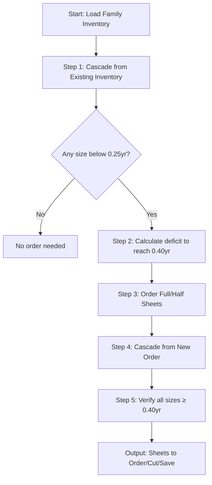

# Reorder Calculator - CSV-Based Decision Engine

**Status:** ✅ Implementation Complete - Ready for Testing
**Created:** 2026-01-01
**Location:** `render-tidb-sync/reports_viewer/`

---

## 📋 Overview

The Reorder Calculator is a CSV-based system that applies decision tree logic to calculate reorder quantities for products. It supports:

- ✅ CSV upload (no manufacturer table dependency)
- ✅ Automated reorder quantity calculations
- ✅ Clarification questions when logic is unclear
- ✅ Manual edit tracking for continuous improvement
- ✅ Oceanside Glass rules (0.35 years target)
- ✅ Bullseye Glass rules (0.25/0.40 thresholds + cascade logic)
- ✅ Cascade Report CSV export (Bullseye only)

---

## 🏗️ Architecture

```
User uploads CSV (without reorder_quantity column)
       ↓
Flask processes CSV → SQLite temp database
       ↓
Decision engine calculates reorder quantities
       ↓
Questions generated (if needed) → Client answers
       ↓
Export CSV with calculated reorder_quantity column
       ↓
User can edit manually → Re-upload to track changes
```

---

## 📁 Files Created

### Core System
```
render-tidb-sync/
├── reports_viewer/
│   ├── __init__.py                     # Blueprint initialization
│   ├── routes.py                       # Flask routes (9 endpoints)
│   ├── database.py                     # Database helper functions
│   ├── schema.sql                      # Database schema (4 tables)
│   ├── decision_engine/
│   │   ├── __init__.py
│   │   ├── base_calculator.py          # Base class for all calculators
│   │   ├── oceanside_calculator.py     # Oceanside-specific logic (0.35yr target)
│   │   ├── bullseye_calculator.py      # Bullseye-specific logic (0.25/0.40yr)
│   │   └── cascade_calculator.py       # 5-step cascade algorithm (Bullseye)
│   └── templates/
│       ├── reorder_upload.html         # CSV upload page
│       ├── reorder_questions.html      # Clarification questions
│       ├── reorder_download.html       # Download results page
│       └── reorder_audit.html          # Manual edits log
├── temp_sessions/                      # SQLite DBs for each session
├── init_reorder_schema.py             # Database initialization script
└── unified_app.py                      # ✅ Updated (blueprint registered)
```

### Modified Files
- `unified_app.py` - Added Reports Viewer blueprint registration
- `requirements.txt` - Added `pandas>=2.0.0`

---

## 🗄️ Database Schema

**Location:** Agent Garden Database (PostgreSQL)

**Tables Created:**
1. `reorder_sessions` - Calculation sessions
2. `reorder_questions` - Clarification questions
3. `reorder_manual_edits` - Audit log for manual changes
4. `reorder_decision_learning` - Track questions for future automation

---

## 🚀 Deployment Instructions

### Step 1: Initialize Database Schema

```bash
cd render-tidb-sync
python init_reorder_schema.py
```

This creates the 4 required tables in the Agent Garden database.

### Step 2: Commit & Push to Git

```bash
cd render-tidb-sync
git add .
git commit -m "Add Reorder Calculator - CSV-based decision engine

- Implemented Oceanside Glass calculator (0.35 years target)
- Created Flask blueprint with upload/questions/download workflow
- Added 4 database tables for sessions, questions, edits, learning
- Integrated with Agent Garden database
- Created beautiful HTML templates with drag-drop upload

🤖 Generated with Claude Code
Co-Authored-By: Claude Sonnet 4.5 <noreply@anthropic.com>"

git push
```

### Step 3: Deploy to Render

Render will automatically deploy when you push to the main branch.

**Verify deployment:**
```
✅ https://gpt-mcp.onrender.com/reports/reorder-calculator
```

---

## 🧪 Testing Instructions

### Test 1: Basic Upload (377 Products)

1. **Navigate to:**
   ```
   https://gpt-mcp.onrender.com/reports/reorder-calculator
   ```

2. **Upload CSV:**
   - File: `Production/Edhoy Warehouse Cutsheet for Shawn - Sheet1.csv`
   - Manufacturer: Oceanside Glass (default)

3. **Expected Result:**
   - Processing completes in 5-10 seconds
   - Redirects to questions page (if any) OR download page
   - Should calculate reorder quantities for products with `Years_in_Stock < 0.35`

### Test 2: Verify Calculations

**Sample Product (from CSV line 2):**
- Product: "Oceanside Glass Almond Opalescent Frit COE96 - Medium Grain"
- Purchased: 15 units/year
- Quantity in Stock: 6 units
- Years in Stock: 6/15 = 0.4 years

**Expected Calculation:**
- Since 0.4 >= 0.35 (target), reorder_quantity should be **0** (no reorder needed)

**Sample Product (from CSV line 4):**
- Product: "Oceanside Glass Almond Opalescent, 3mm COE96 - Size 6"×12""
- Purchased: 5 units/year
- Quantity in Stock: 0 units (ZERO STOCK!)
- Years in Stock: 0/5 = 0 years

**Expected Calculation:**
- Target: 0.35 years × 5 units/year = 1.75 units
- Deficit: 1.75 - 0 = 1.75 units
- Reorder Quantity: **2 units** (rounded up)
- Reason: "URGENT: Zero stock, needs 2 units to reach 0.35 years"

### Test 3: Question Flow

Products with `Purchased = 0` (never sold) should generate HIGH priority questions:

**Expected Question:**
- Priority: HIGH
- Question: "Product '...' has never sold. Should we stock it?"
- Suggested Answer: "No (wait for first sale)"

### Test 4: Download CSV

After processing, download the CSV and verify:

**New Columns Added:**
- `Years_in_Stock` - Calculated metric
- `Reorder_Quantity` - Calculated reorder amount
- `Reorder_Reason` - Explanation for calculation
- `Calculation_Details` - JSON with breakdown

---

## 📊 Decision Tree Logic (Oceanside)

**Source:** `Production/wiki/02_Business_Rules/Years_In_Stock_Thresholds.md`

**Thresholds:**
- **Target:** 0.35 years (128 days)
- **Lean:** 0.20 years (73 days)
- **Well-Stocked:** 0.40 years (146 days)

**Formula:**
```python
years_in_stock = quantity_in_stock / purchased

if years_in_stock >= 0.35:
    reorder_quantity = 0  # Already at target
else:
    target_quantity = purchased * 0.35
    deficit = target_quantity - quantity_in_stock
    reorder_quantity = math.ceil(deficit)  # Round up
```

**Special Cases:**
1. **Purchased = 0** → Generate question (no sales history)
2. **Quantity = 0** → Mark as URGENT
3. **Reorder > 2 years worth** → Generate MEDIUM priority question

---

## 📊 Bullseye Glass Cascade Report

When manufacturer is "Bullseye Glass", a cascade report is automatically generated alongside the standard output.

### Thresholds

| Threshold | Value | Purpose |
|-----------|-------|---------|
| Order trigger | 0.25 years (91 days) | Below this → order needed |
| Order target | 0.40 years (146 days) | Order enough to reach this |

### 5-Step Cascade Algorithm



### Cutting Yields

| Sheet Type | Yields |
|------------|--------|
| 3mm Full Sheet | 6× 10x10 + 2× 5x10 |
| 2mm Half Sheet | 2× 10x10 + 2× 5x10 |
| 2 Half Sheets (3mm) | = 1 Full Sheet equivalent |

### Cascade Options (DOWN only)

| From | To | Ratio |
|------|-----|-------|
| 10x10 | 5x10 | 1:2 |
| 10x10 | 5x5 | 1:4 |
| 5x10 | 5x5 | 1:2 |

### Data Requirements

CSV must include these columns for cascade to work:

| Column | Required | Notes |
|--------|----------|-------|
| Product_Name | ✓ | Must contain size (Half Sheet, 10x10, 5x10, 5x5) OR thickness (3mm/2mm) |
| Vendor_SKU | ✓ | Bullseye format: `XXXX-YYYY-F-FULL` or `XXXX-YYYY-F-HALF` |
| Products_Parent_Id | Recommended | Groups products into families. If 0, uses SKU color code |
| Quantity_in_Stock | ✓ | Must be real inventory (not 150000 placeholder) |
| Purchased | ✓ | Annual sales volume |

**Note:** Products with `Quantity_in_Stock >= 75000` are skipped (parent/placeholder products).

### Cascade Report Output Columns

| Column | Description |
|--------|-------------|
| Parent_ID | Product family identifier |
| Product | Base product name |
| Thickness | 2mm or 3mm |
| Flag | URGENT / REORDER / WATCH |
| Sheets_to_Order | Total sheets to order |
| Sheets_to_Cut | Sheets to cut into smaller sizes |
| Sheets_to_Save | Sheets to keep as Half (uncut) |
| Order_Steps | Cascade decisions made |
| All_Above_04 | Yes/No - validation check |
| *_Before_Stock/Years | Inventory before cascade |
| *_After_Stock/Years | Inventory after cascade |

### Flag Priority

| Flag | Condition |
|------|-----------|
| URGENT | Zero stock + no source material + high volume (≥100/yr) |
| REORDER | Zero stock OR below 28 days critical threshold |
| WATCH | Below 91 days (0.25yr) target |

---

## 🔌 API Endpoints

**Base URL:** `https://gpt-mcp.onrender.com/reports`

| Method | Endpoint | Description |
|--------|----------|-------------|
| GET | `/reorder-calculator` | Upload page |
| POST | `/reorder-calculator/upload` | Process CSV |
| GET | `/reorder-calculator/questions/<session_id>` | Show clarification questions |
| POST | `/reorder-calculator/submit-answers/<session_id>` | Submit answers |
| GET | `/reorder-calculator/download/<session_id>` | Download page with preview |
| GET | `/reorder-calculator/export/<session_id>` | Export final CSV |
| GET | `/reorder-calculator/export-cascade/<session_id>` | Export cascade report CSV (Bullseye) |
| GET | `/reorder-calculator/audit/<session_id>` | Manual edits log |
| GET | `/reorder-calculator/questions` | **Questions Dashboard** (all questions) |
| POST | `/reorder-calculator/save-answer` | Save answer from dashboard |
| POST | `/reorder-calculator/deduplicate` | Clean up duplicate questions |

---

## 📋 Questions Dashboard

**URL:** https://gpt-mcp.onrender.com/reports/reorder-calculator/questions

The Questions Dashboard provides a centralized view of all clarification questions across all calculation sessions.

### Features

| Feature | Description |
|---------|-------------|
| **Default Filter** | Shows only **Pending** questions (unanswered) |
| **Status Filter** | Pending Only / Answered Only / All Questions |
| **Priority Filter** | HIGH / MEDIUM / LOW / All |
| **Stats Cards** | Shows overall totals (not filtered counts) |
| **Clean Duplicates** | Button to remove duplicate questions |

### Filter Options

| Filter Value | URL Parameter | Shows |
|--------------|---------------|-------|
| Pending Only | `?answered=no` | Questions awaiting client answer (default) |
| Answered Only | `?answered=yes` | Questions already answered |
| All Questions | `?answered=all` | Both pending and answered |

**Example URLs:**
```
# Default - pending only
https://gpt-mcp.onrender.com/reports/reorder-calculator/questions

# Show all questions
https://gpt-mcp.onrender.com/reports/reorder-calculator/questions?answered=all

# Show only HIGH priority pending
https://gpt-mcp.onrender.com/reports/reorder-calculator/questions?answered=no&priority=HIGH
```

### Duplicate Question Cleanup

Questions can be duplicated when the same calculation is run multiple times. The deduplication system handles this:

**Cleanup Logic:**
1. Groups questions by `(product_id, field_name)`
2. If any in group is **answered** → keeps answered, deletes pending duplicates
3. If all are **pending** → keeps most recent, deletes older duplicates

**How to Clean:**
1. Go to Questions Dashboard
2. Click "🧹 Clean Duplicates" button
3. Confirm the action
4. Page reloads with duplicates removed

**Prevention:**
- New questions are automatically skipped if an answered duplicate already exists
- Prevents creating questions for already-resolved issues

---

## 🗃️ Where to Get Questions & Answers

### Option 1: Web Dashboard (Recommended)

**URL:** https://gpt-mcp.onrender.com/reports/reorder-calculator/questions

- Visual interface with filtering
- Answer questions directly in browser
- Export not yet available (see Option 3)

### Option 2: API Endpoints

**Get All Questions (JSON):**
```bash
# Not yet implemented - use database query instead
```

### Option 3: Direct Database Query

**Database:** Agent Garden PostgreSQL (same as `DATABASE_URL`)

**Table:** `reorder_questions`

```sql
-- Get all questions with answers
SELECT
    q.question_id,
    q.product_id,
    q.product_name,
    q.priority,
    q.question_text,
    q.field_name,
    q.suggested_answer,
    q.client_answer,
    q.answered_at,
    q.created_at,
    s.manufacturer,
    s.csv_filename
FROM reorder_questions q
JOIN reorder_sessions s ON q.session_id = s.session_id
ORDER BY q.created_at DESC;

-- Get only answered questions
SELECT * FROM reorder_questions
WHERE client_answer IS NOT NULL
ORDER BY answered_at DESC;

-- Get pending questions by priority
SELECT * FROM reorder_questions
WHERE client_answer IS NULL
ORDER BY
    CASE priority WHEN 'HIGH' THEN 1 WHEN 'MEDIUM' THEN 2 ELSE 3 END,
    created_at DESC;

-- Export answers for learning/documentation
SELECT
    product_id,
    product_name,
    field_name,
    question_text,
    suggested_answer,
    client_answer,
    answered_at
FROM reorder_questions
WHERE client_answer IS NOT NULL
ORDER BY field_name, answered_at;
```

### Database Schema Reference

**Table: `reorder_questions`**

| Column | Type | Description |
|--------|------|-------------|
| `question_id` | SERIAL | Primary key |
| `session_id` | VARCHAR(36) | Links to reorder_sessions |
| `product_id` | INTEGER | Product ID (0 for system-wide questions) |
| `product_name` | VARCHAR(255) | Product name or "Bullseye Glass" for system |
| `priority` | VARCHAR(10) | 'HIGH', 'MEDIUM', or 'LOW' |
| `question_text` | TEXT | The question (supports Markdown) |
| `field_name` | VARCHAR(100) | Unique identifier for question type |
| `suggested_answer` | TEXT | Pre-filled suggestion (supports Markdown) |
| `client_answer` | TEXT | NULL if pending, populated when answered |
| `answered_at` | TIMESTAMP | NULL if pending, set when answered |
| `created_at` | TIMESTAMP | When question was generated |

**Table: `reorder_sessions`**

| Column | Type | Description |
|--------|------|-------------|
| `session_id` | VARCHAR(36) | UUID primary key |
| `manufacturer` | VARCHAR(100) | 'Oceanside Glass', 'Bullseye Glass', etc. |
| `csv_filename` | VARCHAR(255) | Original uploaded filename |
| `status` | VARCHAR(50) | 'processing', 'questions', 'complete' |
| `created_at` | TIMESTAMP | When session started |

### Field Names Reference

Questions are identified by `field_name` for deduplication:

| field_name | Priority | Question Type |
|------------|----------|---------------|
| `system_calculator_algorithm` | HIGH | Full algorithm specification |
| `system_output_format` | HIGH | Output format requirements |
| `system_validation_examples` | HIGH | Validation test cases |
| `system_decision_tree_formulas` | MEDIUM | Formula specifications |
| `system_architecture` | MEDIUM | System boundaries |
| `system_seasonal_logic` | MEDIUM | Seasonal product handling |
| `should_stock_new_product` | HIGH | Product with no sales history |
| `reorder_quantity_override` | MEDIUM | High reorder amount confirmation |

---

## 🐛 Troubleshooting

### Error: "Missing required columns"
**Solution:** Ensure CSV has these columns:
- `Product_Name`
- `Product_ID`
- `Purchased`
- `Quantity_in_Stock`

### Error: "Database not configured"
**Solution:** Run `python init_reorder_schema.py` to create tables

### Error: "Session not found"
**Solution:** Sessions expire after download. Re-upload CSV.

### Calculations seem wrong
**Verification Steps:**
1. Check `Purchased` column (should be annual units sold)
2. Verify `Years_in_Stock` = `Quantity_in_Stock` / `Purchased`
3. Check target threshold (Oceanside = 0.35 years)
4. Review `Calculation_Details` column in exported CSV

---

## 🔮 Future Enhancements

### Phase 2 (Partial)
- [x] Bullseye Glass calculator (0.25/0.40 thresholds, cascade logic) ✅ Implemented 2026-01-04
- [ ] Color De Verre calculator (multiples of 5, minimum 10 if zero)
- [ ] Answer incorporation (recalculate when client provides clarifications)
- [ ] Session listing page (view all past calculations)

### Phase 3 (Advanced)
- [ ] Excel export with formatting (color-coded cells)
- [ ] Email delivery (automated daily reports)
- [ ] Historical trend tracking
- [ ] Automated decision rule learning (convert repeated questions → rules)

---

## 📞 Support

**Issues:** Report bugs or request features via GitHub issues
**Documentation:** See `Production/wiki/` for business rules
**Architecture:** See CLAUDE.md Section 9 for Decision Validation system design

---

**Last Updated:** 2026-01-04
**Status:** ✅ Production (Oceanside + Bullseye Cascade)
