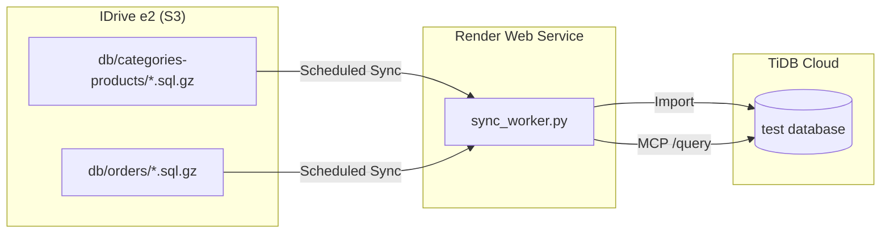

# TiDB Sync Worker - Instructions & Troubleshooting

## Overview

This service syncs data from IDrive e2 backups to TiDB Cloud and provides an MCP server for querying from Claude.

| Property | Value |
|----------|-------|
| **Render Service** | Infinion (`srv-d32h1uqdbo4c73ae7b40`) |
| **URL** | https://gpt-mcp.onrender.com |
| **Sync Schedule** | 6 AM and 6 PM UTC daily |
| **Source** | IDrive e2 (`dbdaily` bucket) |
| **Target** | TiDB Cloud (`test` database) |

---

## Architecture



---

## Endpoints

| Endpoint | Method | Description |
|----------|--------|-------------|
| `/` | GET | Health check |
| `/status` | GET | Sync status + scheduler info |
| `/sync` | POST | Trigger manual sync |
| `/mcp` | POST | MCP JSON-RPC endpoint |
| `/tools` | GET | List available MCP tools |
| `/query` | POST | Direct SQL query |

---

## MCP Tools

| Tool | Description |
|------|-------------|
| `query` | Execute any SELECT query |
| `list_tables` | Show all tables |
| `describe_table` | Get table schema |
| `recent_orders` | Get N most recent orders |
| `today_orders` | Orders placed today + count |
| `order_details` | Full order with products/totals |

---

## Troubleshooting

### Common Issues

| Issue | Cause | Fix |
|-------|-------|-----|
| MCP connection failed | Service sleeping (free tier) | Retry - first request wakes it |
| 0 orders today | Data only as recent as backup | Check sync logs for backup date |
| Sync picks old backup | S3 pagination issue (fixed 2025-12-24) | Ensure using paginator for >1000 files |

### Checking Sync Status

```bash
# Check what backup was used
curl -s https://gpt-mcp.onrender.com/status

# Trigger manual sync
curl -s -X POST https://gpt-mcp.onrender.com/sync

# Query recent orders
curl -s -X POST https://gpt-mcp.onrender.com/query \
  -H "Content-Type: application/json" \
  -d '{"sql": "SELECT orders_id, date_purchased FROM orders ORDER BY date_purchased DESC LIMIT 5"}'
```

### Viewing Logs

Use Render MCP:
```python
mcp__render__list_logs(resource=["srv-d32h1uqdbo4c73ae7b40"], limit=20)
mcp__render__list_logs(resource=["srv-d32h1uqdbo4c73ae7b40"], text=["Latest backup"])
```

---

## Key Bug Fixes

### S3 Pagination Bug (Fixed 2025-12-24)

**Problem:** The orders backup folder had 1834 files, but S3 `list_objects_v2` only returns 1000 per call. The old code didn't paginate, so it missed all December files and picked a November backup as "latest".

**Solution:** Use boto3 paginator to iterate through all pages:
```python
paginator = s3.get_paginator('list_objects_v2')
pages = paginator.paginate(Bucket=S3_BUCKET, Prefix=prefix)
for page in pages:
    # collect all files
```

**Verification:** Logs should show `Scanned X page(s), found Y backup files` where Y > 1000 for orders.

---

## Modifying the Code

**Source:** `sync_worker.py` in this folder

**To add a new MCP tool:**
1. Add tool definition to `MCP_TOOLS` list (~line 375)
2. Add handler in `handle_tool_call()` function (~line 480)
3. Commit and push to `master` branch
4. Render auto-deploys

**Deploy check:**
```python
mcp__render__list_deploys(serviceId="srv-d32h1uqdbo4c73ae7b40", limit=3)
```
