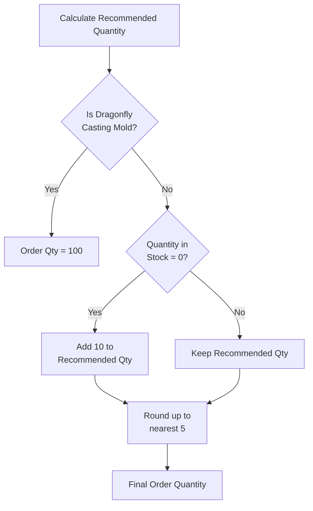

# Color De Verre Ordering Rules

**Vendor:** Color De Verre
**Product Type:** Glass casting molds and related supplies
**Last Updated:** Based on root-level Color De Verre Rule SOP.md

---

## Ordering Rules

| Rule # | Condition | Action | Rationale |
|--------|-----------|--------|-----------|
| 1 | All Color De Verre products | Order in quantities of 5 | Vendor packaging/pricing |
| 2 | Recommended order quantity calculation | Round up to nearest 5 | Maintain Rule #1 compliance |
| 3 | Product with 0 quantity in stock | Add 10 to recommended quantity | Safety stock for stockouts |
| 4 | Dragonfly Casting Mold (specific SKU) | Always order 100 at a time | Special high-volume rule |

---

## Rule Details

### Rule 1: Base Quantity (Multiples of 5)
**Apply to:** All Color De Verre products
**Quantity:** Multiples of 5 only

**Examples:**
- Valid: 5, 10, 15, 20, 25...
- Invalid: 1, 3, 7, 12, 18...

---

### Rule 2: Round Up to 5's
**Apply to:** Calculated reorder quantities
**Method:** Use ceiling function to next multiple of 5

**Examples:**
- Recommended: 7 → Order: 10
- Recommended: 13 → Order: 15
- Recommended: 18 → Order: 20
- Recommended: 25 → Order: 25 (already multiple of 5)

**Formula:**
```python
order_qty = math.ceil(recommended_qty / 5) * 5
```

---

### Rule 3: Zero Stock Premium
**Apply to:** Products with Quantity_in_Stock = 0
**Adjustment:** Add 10 units to recommended quantity (before rounding)

**Logic:**
```
IF Quantity_in_Stock == 0:
    recommended_qty = base_calculation + 10
    order_qty = round_up_to_5(recommended_qty)
ELSE:
    order_qty = round_up_to_5(base_calculation)
```

**Example:**
- Base calculation: 12 units
- In stock: 0
- Adjusted: 12 + 10 = 22 units
- Final order: 25 units (rounded to 5)

**Rationale:** Higher buffer for out-of-stock items to prevent immediate re-stockout

---

### Rule 4: Dragonfly Mold Exception
**Product:** Dragonfly Casting Mold (specific SKU - verify Product_ID)
**Quantity:** Always 100 units
**Override:** Ignores all other rules

**Priority:** Highest (supersedes Rules 1-3)

**Note:** Confirm exact Product_ID or SKU for this special rule

---

## Decision Tree



---

## Implementation Example

```python
def calculate_cdv_order_qty(product_id, recommended_qty, current_stock):
    """
    Calculate Color De Verre order quantity with all rules applied

    Args:
        product_id: Product identifier
        recommended_qty: Base reorder calculation
        current_stock: Current quantity in stock

    Returns:
        Final order quantity (int)
    """
    import math

    # Rule 4: Dragonfly exception
    if is_dragonfly_mold(product_id):
        return 100

    # Rule 3: Zero stock premium
    if current_stock == 0:
        recommended_qty += 10

    # Rule 2: Round up to nearest 5
    order_qty = math.ceil(recommended_qty / 5) * 5

    # Rule 1: Already enforced by Rule 2 (result is multiple of 5)
    return order_qty
```

---

## Testing Examples

| Product | Recommended | In Stock | Dragonfly? | Calculation | Final Order |
|---------|-------------|----------|------------|-------------|-------------|
| CDV-001 | 7 | 5 | No | ceil(7/5)*5 | 10 |
| CDV-002 | 13 | 0 | No | ceil((13+10)/5)*5 | 25 |
| CDV-003 | 18 | 2 | No | ceil(18/5)*5 | 20 |
| CDV-DF | 15 | 3 | Yes | Override | 100 |
| CDV-004 | 25 | 0 | No | ceil((25+10)/5)*5 | 35 |

---

**Related Files:**
- [Vendor_Ordering_Rules.md](./Vendor_Ordering_Rules.md) (master vendor rules)
- [../../03_Decision_Workflows/Vendor_Order_Decision_Tree.md](../03_Decision_Workflows/Vendor_Order_Decision_Tree.md)
