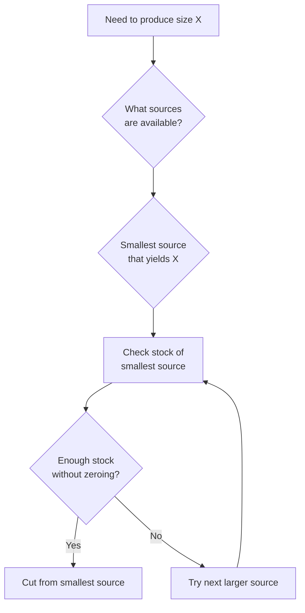

# Glass Sizes and Cutting Yields

**Purpose:** Define standard glass sizes and cutting yields for all manufacturers
**Critical:** These yields are IDEAL (without kerf/trim accounting)

---

## Oceanside Glass COE96

### Standard Sizes (Largest to Smallest)

| Size | Dimensions | Area (sq in) | Retail Use |
|------|------------|--------------|------------|
| Full Sheet | 24"×24" | 576 | Primary full sheet |
| Full Sheet Alt | 24"×22" | 528 | Alternate full sheet |
| Half Sheet | 12"×12" | 144 | Popular mid-size |
| Quarter Sheet | 6"×12" | 72 | Mid-small size |
| Small Square | 6"×6" | 36 | Smallest retail size |

---

### Cutting Yields

#### From 24"×24" Full Sheet
- **4× 12"×12"** pieces (2×2 grid)
- **8× 6"×12"** pieces (2×4 grid)
- **16× 6"×6"** pieces (4×4 grid)

#### From 12"×12" Piece
- **2× 6"×12"** pieces (cut in half lengthwise)
- **4× 6"×6"** pieces (2×2 grid)
- **1× 6"×12" + 2× 6"×6"** (mixed cut)

#### From 6"×12" Piece
- **2× 6"×6"** pieces (cut in half)

**Note:** 6"×6" is the smallest size - never cut further

---

### Sales Distribution (Historical Data)

| Size | Units Sold | % of Total | Insight |
|------|------------|------------|---------|
| 6"×6" | 8,357 | 21.5% | Popular small size |
| 6"×12" | 9,724 | 25.1% | Most popular |
| 12"×12" | 18,442 | 47.5% | Highest volume |
| 24"×24" | 2,292 | 5.9% | Lowest demand |

**Key Insight:** 94% of sales are ≤12"×12", supporting strategy to cut large sheets to zero when optimizing smaller sizes

---

## Bullseye Glass COE90

### Standard Sizes (Largest to Smallest)

| Size | Dimensions | Area (sq in) | Notes |
|------|------------|--------------|-------|
| Full Sheet | 20"×35" | 700 | Received from vendor, immediately cut |
| Half Sheet | 17"×20" | 340 | Largest retail size |
| 10×10 | 10"×10" | 100 | Most popular retail size |
| 5×10 | 5"×10" | 50 | Mid-size option |
| 5×5 | 5"×5" | 25 | Smallest retail size |

---

### Cutting Yields

#### From Full Sheet (20"×35")
- **6× 10×10** + **2× 5×10** (preferred - less scrap)
  - Layout: 3 rows × 2 columns of 10×10
  - Remaining: 2× 5×10 from leftover space

#### From Half Sheet (17"×20")
- **2× 10×10** + **2× 5×10**
  - Layout: 2× 10×10 vertically
  - Remaining: 2× 5×10 from side

#### From 10×10 Piece
- **2× 5×10** (cut in half)
- **4× 5×5** (2×2 grid)
- **1× 5×10 + 2× 5×5** (mixed cut)

#### From 5×10 Piece
- **2× 5×5** (cut in half)

**Note:** 5×5 is the smallest size - never cut further

---

### Cascade Cutting Options (Bullseye)

**Applies to ALL thicknesses (2mm and 3mm):**

```
10×10 → 2× 5×10   (cut in half)
10×10 → 4× 5×5    (cut into quarters)
5×10  → 2× 5×5    (cut in half)
```

**Critical Rule:** Can ONLY cascade DOWN (large to small), NEVER UP
- 5×10 surplus CANNOT help 10×10 deficit
- 5×5 surplus CANNOT help anything (smallest size)

---

### Thickness Variations (Bullseye)

| Thickness | Name | Full Sheet Yield | Half Sheet Yield |
|-----------|------|------------------|------------------|
| 3mm | Double-rolled | 6× 10×10 + 2× 5×10 | 2× 10×10 + 2× 5×10 |
| 2mm | Thin-rolled | N/A (not ordered as full) | 2× 10×10 + 2× 5×10 |

**Special 3mm Rule:** 2 Half Sheets can be cut as 1 Full Sheet equivalent
- 2× Half = 1× Full equivalent yield (6× 10×10 + 2× 5×10)
- **Only applies to 3mm, NOT 2mm**

---

## Source Material Logic

### Which sizes can be used to create each size?

#### Oceanside
- **6"×6"** ← Can cut from: 24"×24", 12"×12", or 6"×12"
- **6"×12"** ← Can cut from: 24"×24" or 12"×12"
- **12"×12"** ← Can cut from: 24"×24" only
- **24"×24"** ← No source (must reorder from vendor)

#### Bullseye
- **5×5** ← Can cut from: Full, Half, 10×10, or 5×10
- **5×10** ← Can cut from: Full, Half, or 10×10
- **10×10** ← Can cut from: Full or Half only
- **Half** ← Can cut from: Full only (or reorder from vendor)

---

## Cutting Direction Rules

**Universal Rule:** Glass can ONLY be cut from larger to smaller sizes

```
✓ ALLOWED:
24"×24" → 12"×12" → 6"×12" → 6"×6"
20"×35" → 17"×20" → 10×10 → 5×10 → 5×5

✗ NOT ALLOWED:
6"×6" → 6"×12" (can't make larger from smaller)
5×5 → 5×10 (can't make larger from smaller)
```

---

## Kerf & Trim Considerations

**Current Status:** Yields shown are IDEAL (no waste factored in)

### Future Enhancement: Real-World Yields

**Kerf:** Width of material removed by saw blade (typically 0.125" per cut)
**Trim:** Edge margin required (typically 0.25" per edge)

**Formula:**
```python
actual_yield = floor((effective_size + kerf) / (piece_size + kerf))
```

**Example Impact:**
- **Ideal:** 24"×24" → 8× 6"×12"
- **Real (kerf=0.125", trim=0.25"):** May reduce to 7× 6"×12"

**Status:** Not yet implemented - requires layout optimization algorithm

---

## Inventory Translation Rules

### Bullseye Half Sheet Counting
- **Even count** in inventory = Full Sheets only
  - Example: 6 "Half Sheets" = 3 Full Sheets
- **Odd count** in inventory = Full Sheets + 1 actual Half
  - Example: 5 "Half Sheets" = 2 Full + 1 Half

**Rationale:** Full sheets immediately cut into 2 Half sheets upon receiving

---

## Decision Matrix: Which Size to Cut From?



**Priority:** Use smallest possible source to minimize waste

---

**Related Files:**
- [Years_In_Stock_Thresholds.md](./Years_In_Stock_Thresholds.md)
- [Cascade_Cutting_Logic.md](./Cascade_Cutting_Logic.md)
- [../../03_Decision_Workflows/Cut_Sheet_Generation_Workflow.md](../03_Decision_Workflows/Cut_Sheet_Generation_Workflow.md)
- [../../05_System_Specific/Oceanside_Glass_System/](../05_System_Specific/Oceanside_Glass_System/)
- [../../05_System_Specific/Bullseye_Glass_System/](../05_System_Specific/Bullseye_Glass_System/)
