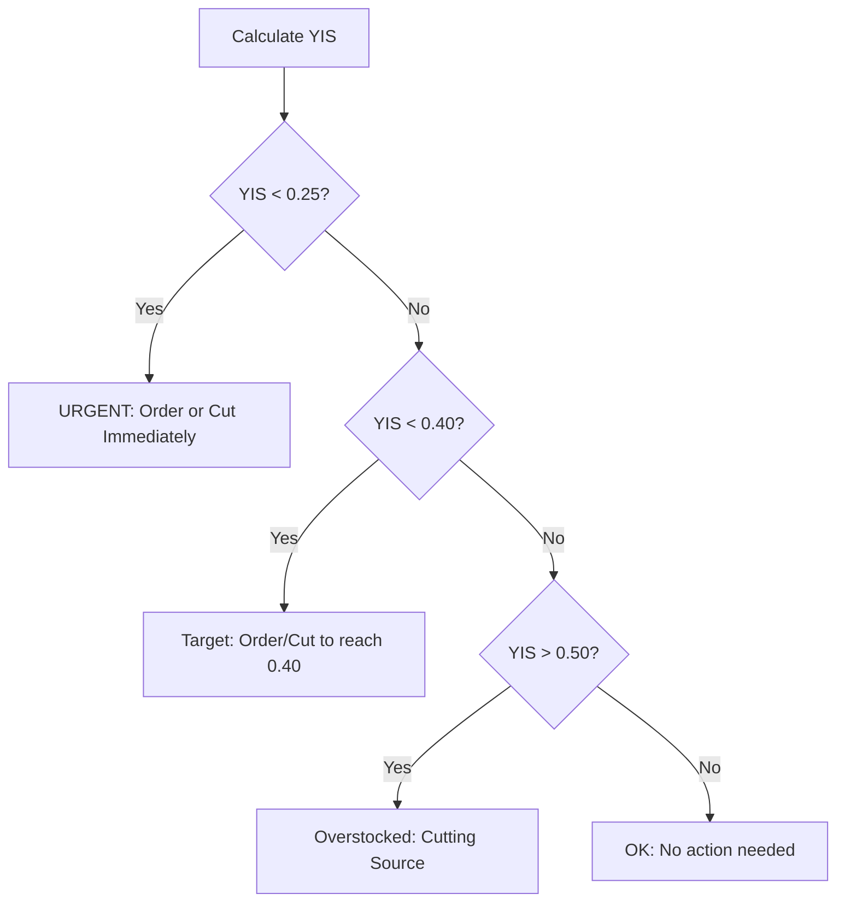

# Years in Stock (YIS) Thresholds

**Purpose:** Define inventory coverage targets across all glass cutting systems
**Metric:** Years in Stock = On-hand Quantity ÷ Annual Units Sold

---

## Formula

```
Years_in_Stock = Quantity_in_Stock / (Purchased_Last_12_Months / 365)

# Equivalently:
Years_in_Stock = (Quantity_in_Stock * 365) / Purchased_Last_12_Months

# In days:
Days_in_Stock = (Quantity_in_Stock * 365) / Purchased_Last_12_Months
```

---

## System-Specific Thresholds

### Oceanside Glass System

| Threshold | Years | Days | Purpose |
|-----------|-------|------|---------|
| Lean Inventory | 0.20 | 73 | Minimum acceptable (2.4 months) |
| Target Coverage | 0.35 | 128 | Standard reorder target (4.2 months) |
| Well-Stocked | 0.40 | 146 | Adequate stock threshold (4.8 months) |
| Overstocked | > 0.40 | > 146 | May need cutting down |

**Source:** Comprehensive_Glass_Cutting_Process.md, lines 55-67

---

### Bullseye Glass - Cut Sheets System

| Threshold | Years | Days | Purpose |
|-----------|-------|------|---------|
| Minimum Coverage | 0.25 | 91 | Get products off zero target |
| Cycle Frequency | - | 14 | Biweekly cut sheet generation |
| Urgent (Tier 2) | - | < 14 | Will stockout before next cycle |
| Watch (Tier 2) | - | 28-56 | On the radar |
| OK (Tier 3) | - | > 56 | Not a problem |

**Source:** Bullseye Glass/MASTER_CONTEXT_PROMPT.md

**Notes:**
- Cut Sheet system focuses on preventing zeros
- "Good enough" threshold: 0.25 years (91 days)
- Cutting is for bridging gaps, not solving demand mismatches

---

### Bullseye Glass - Ordering System

| Threshold | Years | Days | Purpose |
|-----------|-------|------|---------|
| Order Decision | 0.25 | 91 | If ANY size below → ORDER |
| Order Target | 0.40 | 146 | Get ALL sizes to this level |
| Lead Time Buffer | - | 35 | Shipping (17-21d) + receiving (14d) |
| Worst Case Buffer | - | 72 | Maximum total lead time |
| Target with Buffer | 0.496 | 181 | 0.40yr + 35 days |

**Source:** Bullseye Glass/MASTER_CONTEXT_PROMPT.md

**Order Frequency:** ~10 orders/year (every 37 days average)

---

## Threshold Comparison Table

| System | Minimum | Target | Well-Stocked | Cycle/Frequency |
|--------|---------|--------|--------------|-----------------|
| Oceanside | 0.20yr (73d) | 0.35yr (128d) | 0.40yr (146d) | Ad-hoc |
| Bullseye Cuts | 0.25yr (91d) | - | - | 14 days |
| Bullseye Orders | 0.25yr (91d) | 0.40yr (146d) | 0.40yr (146d) | 37 days |

---

## Calculation Examples

### Example 1: Fast-Moving Product
- **In Stock:** 116 units
- **Purchased (annual):** 326 units
- **Years in Stock:** 116 / 326 = 0.356 years (~4.3 months)
- **Status:** Between target (0.35) and well-stocked (0.40)

### Example 2: Slow-Moving Product
- **In Stock:** 37 units
- **Purchased (annual):** 231 units
- **Years in Stock:** 37 / 231 = 0.16 years (~1.9 months)
- **Status:** Below minimum (0.20) - URGENT reorder needed

### Example 3: Overstocked Product
- **In Stock:** 50 units
- **Purchased (annual):** 85 units
- **Years in Stock:** 50 / 85 = 0.588 years (~7.1 months)
- **Status:** Overstocked (>0.40) - cutting candidate

---

## Interpretation Guide

### Oceanside System
- **< 0.20:** Urgent reorder or cut immediately
- **0.20 - 0.35:** Reorder soon or cut from larger sizes
- **0.35 - 0.40:** Ideal range
- **> 0.40:** Possible cutting source for smaller sizes

### Bullseye Cut Sheets
- **0 in stock:** Tier 1 - HIGHEST priority
- **< 0.25 (91d):** Tier 2 - needs cutting
- **0.25+:** Adequate, low priority

### Bullseye Ordering
- **< 0.25 (91d):** Order decision triggered
- **0.25 - 0.40:** May order to reach target
- **0.40+:** No order needed (unless other sizes require it)

---

## Special Cases

### Products with No Sales History
- **Years_in_Stock:** undefined (division by zero)
- **Treatment:** Exclude from automatic calculations
- **Manual review:** Required for new products

### Seasonal Products
- **Example:** Holly Berry Red (must order by June 30)
- **Adjustment:** May need higher buffer
- **Override:** Manual threshold adjustment allowed

### High-Volume Products
- **Purchased > 100/year:** Higher sensitivity to stockouts
- **Buffer:** Consider higher minimum (e.g., 0.30 instead of 0.25)

---

## Decision Matrix



---

## Related Formulas

### Minimum Stock for Target YIS
```python
min_stock = math.ceil(target_years * purchased / 365)

# For 0.25 years (91 days):
min_stock_025 = math.ceil(0.25 * purchased / 365)

# For 0.40 years (146 days):
min_stock_040 = math.ceil(0.40 * purchased / 365)
```

### Deficit Calculation
```python
deficit = max(0, min_stock - current_stock)
```

### Reorder Quantity
```python
reorder_qty = deficit
# Or with buffer:
reorder_qty = deficit + safety_buffer
```

---

**Related Files:**
- [Glass_Sizes_and_Cutting_Yields.md](./Glass_Sizes_and_Cutting_Yields.md)
- [Cascade_Cutting_Logic.md](./Cascade_Cutting_Logic.md)
- [../../03_Decision_Workflows/Reorder_Calculation_Workflow.md](../03_Decision_Workflows/Reorder_Calculation_Workflow.md)
