# Bullseye Vendor Purchase Decision Tree

**Purpose:** Determine how much/how many products to purchase from Bullseye Glass vendor
**System:** Bullseye COE90 Glass Ordering System
**Frequency:** ~10 orders/year (every 37 days average)
**Last Updated:** 2025-12-30

---

## 📋 Overview

This workflow determines the **optimal quantity to purchase** from Bullseye Glass vendor when inventory needs replenishment. It implements a **5-step algorithm** that:
1. Cascades from existing inventory FIRST (saves money!)
2. Checks if vendor order is actually needed (0.25yr threshold)
3. Calculates minimum order to reach 0.40yr coverage
4. Cascades from new order to maximize efficiency
5. Verifies ALL sizes meet target (including Half Sheets!)

**Critical:** Always check cascade opportunities BEFORE ordering - this is the #1 source of errors.

---

## 🎯 Complete Purchase Decision Tree

```mermaid
graph TD
    A[Start: Review Product Inventory] --> B{Product Thickness?}

    B -->|3mm| C[STEP 1: CASCADE FROM INVENTORY<br/>3mm Special]
    B -->|2mm| D[STEP 1: CASCADE FROM INVENTORY<br/>2mm Standard]

    C --> E{Excess Half Sheets?<br/>Half Stock > 0.40yr Min?}
    E -->|Yes - Excess ≥ 2| F[Calculate Cascade:<br/>2 Half = 1 Full equiv]
    E -->|No - At/Below Min| G[No Half Cascade<br/>Keep Current]

    F --> H[Cut Pairs as Full:<br/>2 Half → 6×10×10 + 2×5×10]
    H --> I[Update Inventory<br/>After Cascade]

    D --> J{Any Size Has<br/>Excess?}
    J -->|Yes| K[Cascade Down:<br/>10×10→5×10<br/>10×10→5×5<br/>5×10→5×5]
    J -->|No| L[No Cascade<br/>Keep Current]

    K --> I
    G --> I
    L --> I

    I --> M[STEP 2: CHECK IF ORDER NEEDED]
    M --> N{Calculate YIS<br/>for Each Size}

    N --> O[Years = Stock ÷ Purchased/365]
    O --> P{ANY Size<br/>Below 0.25 Years?}

    P -->|No - All ≥ 0.25yr| Q[✅ NO ORDER NEEDED<br/>Inventory Sufficient]
    P -->|Yes - At Least One < 0.25yr| R[⚠️ ORDER NEEDED]

    R --> S[STEP 3: CALCULATE MINIMUM ORDER]
    S --> T{Product Thickness?}

    T -->|3mm| U[Calculate 3mm Order]
    T -->|2mm| V[Calculate 2mm Order]

    U --> W{Half Sheet Deficit?}
    W -->|Yes - Half < 0.40yr| X[Priority: SAVE Fulls as Half<br/>Half_Save = ⌈Deficit ÷ 2⌉]
    W -->|No - Half OK| Y[No Saving Needed]

    X --> Z[Calculate 10×10 Deficit]
    Y --> Z

    Z --> AA[Full_Cut = ⌈10×10 Deficit ÷ 6⌉]
    AA --> AB[Check 5×10 Needs]
    AB --> AC{5×10 Need More?}

    AC -->|Yes| AD[Increase Full_Cut]
    AC -->|No| AE[Use Byproduct 5×10]

    V --> AF{Half Sheet Deficit?}
    AF -->|Yes| AG[SAVE Half Sheets Uncut<br/>Half_Save = Deficit]
    AF -->|No| AH[No Saving Needed]

    AG --> AI[Calculate Half_Cut<br/>For 10×10/5×10]
    AH --> AI

    AI --> AJ[Half_Cut = ⌈Deficit ÷ Yield⌉]

    AD --> AK[STEP 4: CASCADE FROM NEW ORDER]
    AE --> AK
    AJ --> AK

    AK --> AL{10×10 Surplus<br/>After Cuts?}

    AL -->|Yes - Excess| AM[Cascade Options:<br/>10×10→2×5×10 OR<br/>10×10→4×5×5]
    AL -->|No - At Target| AN[No 10×10 Cascade]

    AM --> AO{5×10 Surplus?}
    AN --> AO

    AO -->|Yes - Excess| AP[Cascade:<br/>5×10→2×5×5]
    AO -->|No - At Target| AQ[No 5×10 Cascade]

    AP --> AR[STEP 5: FINAL VERIFICATION]
    AQ --> AR

    AR --> AS{Calculate Final YIS<br/>All Sizes}
    AS --> AT[Final Years = Stock ÷ Purchased/365]

    AT --> AU{ALL Sizes ≥ 0.40yr?<br/>Including Half!}

    AU -->|Yes - All Pass| AV[✅ ORDER APPROVED<br/>Generate Purchase Order]
    AU -->|No - Some Below| AW[❌ RECALCULATE<br/>Increase Order]

    AW --> S
    Q --> AX[Document:<br/>No Order Needed]
    AV --> AY[Document Order:<br/>X Fulls X Halfs<br/>X Cut X Save]

    AX --> AZ[End]
    AY --> AZ

    style Q fill:#90EE90
    style AV fill:#90EE90
    style R fill:#FFD700
    style AW fill:#FFB6C1
    style H fill:#87CEEB
    style AM fill:#87CEEB
    style AP fill:#87CEEB
```



---

## 📊 Purchase Decision Matrix

### Threshold Reference

| Threshold | Days | Years | Purpose |
|-----------|------|-------|---------|
| **Order Decision** | 91 days | 0.25 years | If ANY size below this after cascade → ORDER |
| **Order Target** | 146 days | 0.40 years | All sizes must reach this level |
| **Lead Time Buffer** | 35 days | - | Safety margin (17-21 days shipping + 14 days receiving) |
| **Worst Case** | 72 days | - | Maximum lead time scenario |

### Cutting Yields by Thickness

| Source | Thickness | Yield | Notes |
|--------|-----------|-------|-------|
| **Full Sheet** | 3mm | 6× 10×10 + 2× 5×10 | Primary wholesale size |
| **2 Half Sheets** | 3mm ONLY | 6× 10×10 + 2× 5×10 | **2 Half = 1 Full equivalent** |
| **Half Sheet** | 2mm | 2× 10×10 + 2× 5×10 | Cannot combine |
| **Half Sheet** | 3mm | Save as retail size | Don't cut if deficit |

### Cascade Options (All Thicknesses)

| Source Size | Target Size | Yield | Direction |
|-------------|-------------|-------|-----------|
| 10×10 | 5×10 | 2 pieces | ⬇️ Down only |
| 10×10 | 5×5 | 4 pieces | ⬇️ Down only |
| 5×10 | 5×5 | 2 pieces | ⬇️ Down only |
| 5×10 | 10×10 | ❌ NOT POSSIBLE | Cannot go UP |
| 5×5 | ANY | ❌ NOT POSSIBLE | Smallest size |

---

## 🔢 The 5-Step Algorithm (Detailed)

### STEP 1: CASCADE FROM EXISTING INVENTORY

**Goal:** Minimize vendor order by using existing inventory creatively

**For 3mm Products:**

```
Calculate:
  Half_Min_for_0.4yr = ⌈(146 × Purchased) ÷ 365⌉
  Half_Excess = Half_Stock - Half_Min_for_0.4yr

If Half_Excess ≥ 2:
  Can_Cascade = ⌊Half_Excess ÷ 2⌋ Full Sheet equivalents
  Each Cascade: 2 Half → 6× 10×10 + 2× 5×10

Update Inventory:
  Half_Stock = Half_Stock - (Can_Cascade × 2)
  10×10_Stock = 10×10_Stock + (Can_Cascade × 6)
  5×10_Stock = 5×10_Stock + (Can_Cascade × 2)
```

**For All Products:**

```
Check each size for excess:
  If 10×10_Stock > 10×10_Min_for_0.4yr:
    Cascade to 5×10 or 5×5 as needed

  If 5×10_Stock > 5×10_Min_for_0.4yr:
    Cascade to 5×5 as needed
```

**Example (3mm):**
- Half Sheet: 18 pieces (0.65 YIS)
- Half Min for 0.40yr: 10 pieces
- Excess: 18 - 10 = 8 pieces
- Can cascade: ⌊8 ÷ 2⌋ = 4 Full equivalents
- Result: Cascade 8 Half → 24× 10×10 + 8× 5×10
- Remaining Half: 10 pieces (exactly at 0.40 YIS)

---

### STEP 2: CHECK IF ORDER NEEDED

**Goal:** Determine if vendor order is actually required

```
For each size (Half, 10×10, 5×10, 5×5):
  Years_in_Stock = Stock ÷ (Purchased ÷ 365)

Decision:
  IF any Years_in_Stock < 0.25:
    ORDER NEEDED → Proceed to Step 3
  ELSE:
    NO ORDER → Document and exit
```

**Example:**
- Half: 10 pieces ÷ (24.6 ÷ 365) = 148 days = 0.41 YIS ✅
- 10×10: 30 pieces ÷ (180 ÷ 365) = 61 days = 0.17 YIS ❌ **Below 0.25!**
- 5×10: 40 pieces ÷ (90 ÷ 365) = 162 days = 0.44 YIS ✅
- 5×5: 20 pieces ÷ (60 ÷ 365) = 122 days = 0.33 YIS ✅

**Decision:** ORDER NEEDED (10×10 is below 0.25 years)

---

### STEP 3: CALCULATE MINIMUM ORDER

**Goal:** Determine exact sheets to order to get ALL sizes to 0.40yr

**For 3mm Products:**

```
Step 3a: Check Half Sheet Deficit
  Half_Target = ⌈(146 × Half_Purchased) ÷ 365⌉
  Half_Deficit = Half_Target - Half_Current

  If Half_Deficit > 0:
    Half_Save = ⌈Half_Deficit ÷ 2⌉ Full Sheets
    (Save as Half without cutting)

Step 3b: Calculate 10×10 Needs
  10×10_Target = ⌈(146 × 10×10_Purchased) ÷ 365⌉
  10×10_Deficit = 10×10_Target - 10×10_Current
  10×10_Cut = ⌈10×10_Deficit ÷ 6⌉ Full Sheets

Step 3c: Check 5×10 Byproduct
  Byproduct_5×10 = 10×10_Cut × 2
  5×10_Target = ⌈(146 × 5×10_Purchased) ÷ 365⌉
  5×10_Deficit = 5×10_Target - (5×10_Current + Byproduct_5×10)

  If 5×10_Deficit > 0:
    Additional_Cuts = ⌈5×10_Deficit ÷ 2⌉
    10×10_Cut = 10×10_Cut + Additional_Cuts

Total Order:
  Full_Sheets_Needed = Half_Save + 10×10_Cut
```

**For 2mm Products:**

```
Step 3a: Check Half Sheet Deficit
  Half_Deficit = Half_Target - Half_Current
  If Half_Deficit > 0:
    Half_Save = Half_Deficit (save uncut)

Step 3b: Calculate Half Sheets to Cut
  10×10_Deficit = 10×10_Target - 10×10_Current
  5×10_Deficit = 5×10_Target - 5×10_Current

  Half_Cut = ⌈10×10_Deficit ÷ 2⌉
  (Each Half yields 2× 10×10 + 2× 5×10)

Total Order:
  Half_Sheets_Needed = Half_Save + Half_Cut
```

**Example (3mm):**
- Half: Need 12, have 10 → Deficit 2 → Save 1 Full as 2 Half
- 10×10: Need 72, have 30 → Deficit 42 → Cut ⌈42 ÷ 6⌉ = 7 Fulls
- 5×10: Byproduct from 7 cuts = 14 pieces, Need 36, have 40 + 14 = 54 ✅
- **Total Order:** 8 Full Sheets (1 save as Half + 7 cut)

---

### STEP 4: CASCADE FROM NEW ORDER

**Goal:** Use byproducts and surplus from cutting to fill remaining gaps

```
After cutting Full Sheets:
  Check 10×10 Surplus:
    If 10×10_Current > 10×10_Target:
      Surplus = 10×10_Current - 10×10_Target

      If 5×10 needs coverage:
        Cascade: ⌈5×10_Deficit ÷ 2⌉ × 10×10 → 5×10
        (Each 10×10 yields 2× 5×10)

      Else if 5×5 needs coverage:
        Cascade: ⌈5×5_Deficit ÷ 4⌉ × 10×10 → 5×5
        (Each 10×10 yields 4× 5×5)

  Check 5×10 Surplus:
    If 5×10_Current > 5×10_Target:
      Surplus = 5×10_Current - 5×10_Target

      If 5×5 needs coverage:
        Cascade: ⌈5×5_Deficit ÷ 2⌉ × 5×10 → 5×5
        (Each 5×10 yields 2× 5×5)
```

**Example:**
- After 7 Full cuts: 10×10 = 30 + 42 = 72 ✅ (exactly at target)
- 5×10 = 40 + 14 = 54 (target is 36, surplus 18!)
- 5×5 = 20 (target is 24, deficit 4)
- **Cascade:** 2× 5×10 → 4× 5×5
- **Result:** 5×10 = 52 (still above target), 5×5 = 24 ✅

---

### STEP 5: VERIFY ALL SIZES ABOVE 0.40 YEARS

**Goal:** Ensure EVERY size meets target (including Half Sheet!)

```
For each size (Half, 10×10, 5×10, 5×5):
  Final_Years = Final_Stock ÷ (Purchased ÷ 365)

  If Final_Years < 0.40:
    ❌ FAILED VERIFICATION
    Return to Step 3, increase order

  Else:
    ✅ PASS

If ALL sizes pass:
  ✅ ORDER APPROVED
  Document: X Full Sheets (Y cut + Z save as Half)
```

**Example Verification:**
- Half: 12 ÷ (24.6 ÷ 365) = 178 days = 0.49 YIS ✅
- 10×10: 72 ÷ (180 ÷ 365) = 146 days = 0.40 YIS ✅
- 5×10: 52 ÷ (90 ÷ 365) = 211 days = 0.58 YIS ✅
- 5×5: 24 ÷ (60 ÷ 365) = 146 days = 0.40 YIS ✅

**Decision:** ✅ ALL ABOVE 0.40 YEARS → **ORDER: 8 Full Sheets**

---

## ⚠️ Critical Decision Points

### Decision Point 1: Can We Cascade from Inventory?

**Question:** Does existing inventory have excess that can be cut?

**For 3mm:**
```
IF (Half_Stock - Half_Min_for_0.4yr) ≥ 2:
  → CASCADE 2 Half = 1 Full equivalent
ELSE:
  → No cascade, proceed to order check
```

**For all thicknesses:**
```
IF 10×10_Stock > 10×10_Target AND (5×10 OR 5×5 has deficit):
  → CASCADE 10×10 down

IF 5×10_Stock > 5×10_Target AND 5×5 has deficit:
  → CASCADE 5×10 → 5×5
```

**Impact:** Cascading from inventory can **eliminate or reduce** vendor order significantly.

---

### Decision Point 2: Is Order Actually Needed?

**Question:** After inventory cascade, are we still below threshold?

```
Calculate YIS for each size

IF ANY size < 0.25 years:
  → ORDER NEEDED
ELSE:
  → NO ORDER (cascade was sufficient!)
```

**Common Scenario:**
- Before cascade: 10×10 at 0.20 YIS (below 0.25)
- Cascade 2 Half → adds 6× 10×10
- After cascade: 10×10 at 0.28 YIS (above 0.25)
- **Result:** NO ORDER NEEDED! Cascade solved the problem.

---

### Decision Point 3: Do We Need to Save Full Sheets as Half?

**Question:** Does Half Sheet have a deficit?

**For 3mm:**
```
Half_Deficit = Half_Target - Half_Current

IF Half_Deficit > 0:
  Half_Save = ⌈Half_Deficit ÷ 2⌉ Full Sheets
  (Each Full saved as 2 Half retail pieces)
ELSE:
  Half_Save = 0 (can cut all Fulls)
```

**Critical:** If Half has deficit, must SAVE Fulls as Half BEFORE cutting for 10×10!

**Example:**
- Half: Need 20, have 14 → Deficit 6
- Half_Save = ⌈6 ÷ 2⌉ = 3 Full Sheets saved as Half
- These 3 Fulls do NOT get cut into 10×10!

---

### Decision Point 4: Should We Cascade Surplus?

**Question:** After cutting, do we have excess that can help other sizes?

```
If 10×10_Surplus > 0 AND (5×10 OR 5×5 below target):
  → CASCADE to fill gaps

If 5×10_Surplus > 0 AND 5×5 below target:
  → CASCADE to fill gaps
```

**Benefit:** Reach 0.40yr on ALL sizes with minimal order.

**Example:**
- 10×10 surplus: 6 pieces
- 5×5 deficit: 8 pieces
- Cascade: 2× 10×10 → 8× 5×5
- Result: 10×10 still has 4 surplus (acceptable), 5×5 at target

---

## 📈 Complete Decision Examples

### Example 1: 3mm Product - Cascade Eliminates Order

**Product:** Black Opal 3mm

**BEFORE:**
```
Size         Stock    Years  Purchased  Target(0.4yr)  Deficit
------------------------------------------------------------------
Half            18     0.65         24.6            10        0
10×10           30     0.20        180.0            72       42
5×10            40     0.54         90.0            36        0
5×5             20     0.40         60.0            24        4
```

**STEP 1: CASCADE FROM INVENTORY**
- Half excess: 18 - 10 = 8 pieces
- Can cascade: ⌊8 ÷ 2⌋ = 4 Full equivalents
- Cascade: 8 Half → 24× 10×10 + 8× 5×10

**AFTER INVENTORY CASCADE:**
```
Size         Stock    Years  Purchased  Target(0.4yr)  Deficit
------------------------------------------------------------------
Half            10     0.41         24.6            10        0
10×10           54     0.37        180.0            72       18
5×10            48     0.65         90.0            36        0
5×5             20     0.40         60.0            24        4
```

**STEP 2: CHECK IF ORDER NEEDED**
- 10×10: 0.37 YIS > 0.25 ✅ (improved from 0.20!)
- But still < 0.40 target...

Wait - recheck threshold:
- 0.37 years = 135 days > 91 days (0.25 threshold) ✅
- **Decision:** Still need order (10×10 below 0.40 target)

Actually, let me recalculate - the ORDER DECISION threshold is 0.25yr, not 0.40yr!
- 10×10: 0.37 YIS **> 0.25** ✅
- All other sizes > 0.25 ✅
- **Decision:** ✅ **NO ORDER NEEDED!** (All above 0.25yr threshold)

But we want to reach 0.40yr target...

**Clarification:** The algorithm has TWO thresholds:
1. **0.25yr** = Order Decision (if below, must order)
2. **0.40yr** = Order Target (when ordering, get to this level)

Since 10×10 is 0.37yr (above 0.25 but below 0.40), we could:
- Option A: No order (acceptable coverage)
- Option B: Order small amount to reach 0.40

**Conservative Decision:** Order to reach 0.40yr

**STEP 3: CALCULATE MINIMUM ORDER**
- 10×10 deficit: 72 - 54 = 18 pieces
- 5×5 deficit: 24 - 20 = 4 pieces
- Half: No deficit (at minimum)
- Full_Cut = ⌈18 ÷ 6⌉ = 3 Full Sheets

**STEP 4: CASCADE FROM NEW ORDER**
- Cut 3 Fulls → 18× 10×10 + 6× 5×10
- 10×10: 54 + 18 = 72 ✅
- 5×10: 48 + 6 = 54 (surplus 18)
- Cascade 2× 5×10 → 4× 5×5
- 5×5: 20 + 4 = 24 ✅

**AFTER ORDER + CASCADE:**
```
Size         Stock    Years  Purchased  Target(0.4yr)  Status
------------------------------------------------------------------
Half            10     0.41         24.6            10        ✅
10×10           72     0.40        180.0            72        ✅
5×10            52     0.71         90.0            36        ✅
5×5             24     0.40         60.0            24        ✅
```

**VERIFICATION:** ✅ ALL ABOVE 0.40 YEARS

**ORDER:** **3 Full Sheets** (all cut, none saved)

---

### Example 2: 3mm Product - Half Deficit Requires Saving

**Product:** Teal Green Transparent 3mm

**BEFORE:**
```
Size         Stock    Years  Purchased  Target(0.4yr)  Deficit
------------------------------------------------------------------
Half             4     0.16         30.0            12        8
10×10           20     0.13        180.0            72       52
5×10            30     0.41         90.0            36        0
5×5             15     0.30         60.0            24        9
```

**STEP 1: CASCADE FROM INVENTORY**
- Half: 4 - 12 = -8 (DEFICIT, cannot cascade)
- 10×10: 20 - 72 = -52 (deficit)
- 5×10: 30 - 36 = -6 (small deficit)
- No cascade possible (all below target)

**AFTER INVENTORY CASCADE:**
```
(No changes - no cascade)
```

**STEP 2: CHECK IF ORDER NEEDED**
- Half: 0.16 YIS < 0.25 ❌
- 10×10: 0.13 YIS < 0.25 ❌
- **Decision:** ⚠️ **ORDER NEEDED**

**STEP 3: CALCULATE MINIMUM ORDER**
- Half deficit: 8 pieces → Half_Save = ⌈8 ÷ 2⌉ = **4 Full Sheets saved as Half**
- 10×10 deficit: 52 pieces → Full_Cut = ⌈52 ÷ 6⌉ = 9 Full Sheets
- Total: 4 + 9 = **13 Full Sheets**

**STEP 4: CASCADE FROM NEW ORDER**
- Save 4 Fulls as 8 Half → Half: 4 + 8 = 12 ✅
- Cut 9 Fulls → 54× 10×10 + 18× 5×10
- 10×10: 20 + 54 = 74 (surplus 2)
- 5×10: 30 + 18 = 48 (surplus 12)
- 5×5 deficit: 9 pieces
- Cascade 3× 5×10 → 6× 5×5 (using surplus)
- 5×5: 15 + 6 = 21... still need 3 more
- Cascade 1× 10×10 → 4× 5×5
- 5×5: 21 + 4 = 25 ✅

**AFTER ORDER + CASCADE:**
```
Size         Stock    Years  Purchased  Target(0.4yr)  Status
------------------------------------------------------------------
Half            12     0.49         30.0            12        ✅
10×10           73     0.50        180.0            72        ✅
5×10            45     0.61         90.0            36        ✅
5×5             25     0.51         60.0            24        ✅
```

**VERIFICATION:** ✅ ALL ABOVE 0.40 YEARS

**ORDER:** **13 Full Sheets** (4 saved as Half + 9 cut)

---

### Example 3: 2mm Product - Different Logic

**Product:** White Opal 2mm

**BEFORE:**
```
Size         Stock    Years  Purchased  Target(0.4yr)  Deficit
------------------------------------------------------------------
Half             8     0.33         30.0            12        4
10×10           35     0.24        180.0            72       37
5×10            40     0.55         90.0            36        0
5×5             20     0.41         60.0            24        4
```

**STEP 1: CASCADE FROM INVENTORY**
- 2mm cannot combine Half Sheets (not 3mm!)
- 5×10 has surplus: 40 - 36 = 4
- Can cascade to 5×5: 2× 5×10 → 4× 5×5
- 5×5: 20 + 4 = 24 ✅ (deficit filled!)

**AFTER INVENTORY CASCADE:**
```
Size         Stock    Years  Purchased  Target(0.4yr)  Deficit
------------------------------------------------------------------
Half             8     0.33         30.0            12        4
10×10           35     0.24        180.0            72       37
5×10            38     0.52         90.0            36        0
5×5             24     0.49         60.0            24        0
```

**STEP 2: CHECK IF ORDER NEEDED**
- 10×10: 0.24 YIS < 0.25 ❌
- **Decision:** ⚠️ **ORDER NEEDED**

**STEP 3: CALCULATE MINIMUM ORDER (2mm Logic)**
- Half deficit: 4 pieces → Half_Save = **4 Half Sheets** (save uncut, not combined!)
- 10×10 deficit: 37 pieces
- Each Half (2mm) yields: 2× 10×10 + 2× 5×10
- Half_Cut = ⌈37 ÷ 2⌉ = 19 Half Sheets
- Total: 4 + 19 = **23 Half Sheets**

**STEP 4: CASCADE FROM NEW ORDER**
- Save 4 Half uncut → Half: 8 + 4 = 12 ✅
- Cut 19 Half → 38× 10×10 + 38× 5×10
- 10×10: 35 + 38 = 73 (surplus 1) ✅
- 5×10: 38 + 38 = 76 (huge surplus 40!)

**AFTER ORDER + CASCADE:**
```
Size         Stock    Years  Purchased  Target(0.4yr)  Status
------------------------------------------------------------------
Half            12     0.49         30.0            12        ✅
10×10           73     0.50        180.0            72        ✅
5×10            76     1.04         90.0            36        ✅✅
5×5             24     0.49         60.0            24        ✅
```

**VERIFICATION:** ✅ ALL ABOVE 0.40 YEARS

**ORDER:** **23 Half Sheets** (4 saved + 19 cut)

**Note:** 5×10 has significant surplus (1.04 YIS), but this is acceptable byproduct.

---

## 🚨 Common Errors and Prevention

### Error 1: Forgot to Cascade from Inventory FIRST

**❌ Wrong:**
- See 10×10 at 0.20 YIS
- Immediately calculate order: 52 pieces needed
- Order 9 Full Sheets

**✅ Correct:**
- Check Half Sheet excess first
- Cascade 2 Half → 6× 10×10 + 2× 5×10
- Recalculate 10×10 need (now only 46 pieces)
- Order 8 Full Sheets (saved 1!)

**Prevention:** Always execute STEP 1 before STEP 2.

---

### Error 2: Applied 3mm Logic to 2mm

**❌ Wrong:**
- 2mm product with 10 Half Sheets
- Thought: "2 Half = 1 Full, so I can cascade 5 Full equivalents"
- **ERROR:** 2mm does NOT allow combining Half Sheets!

**✅ Correct:**
- 2mm Half Sheets cut individually: 2× 10×10 + 2× 5×10 each
- Cannot combine pairs

**Prevention:** Check thickness BEFORE applying cascade logic.

---

### Error 3: Forgot Half Sheet Deficit

**❌ Wrong:**
- Half: 8 pieces (need 12, deficit 4)
- 10×10: 30 pieces (need 72, deficit 42)
- Calculated: 7 Full Sheets for 10×10 only
- **ERROR:** Didn't save Fulls for Half deficit!

**✅ Correct:**
- Half deficit: 4 → Save 2 Fulls as 4 Half
- 10×10 deficit: 42 → Cut 7 Fulls
- **Total order:** 9 Full Sheets (2 save + 7 cut)

**Prevention:** Always check Half Sheet FIRST in Step 3.

---

### Error 4: Didn't Verify Half Sheet in Final Check

**❌ Wrong:**
- Verified: 10×10 ✅, 5×10 ✅, 5×5 ✅
- Forgot to check Half Sheet
- Half ended at 0.35 YIS (below 0.40!)
- **ERROR:** Order approved despite Half below target

**✅ Correct:**
- Verify **ALL FOUR SIZES** including Half
- Half must also be ≥ 0.40 YIS
- If Half below, increase Half_Save

**Prevention:** Use checklist - verify EVERY size in Step 5.

---

### Error 5: Cascaded UP Instead of DOWN

**❌ Wrong:**
- 5×10 surplus: 20 pieces
- Thought: "I can combine 2× 5×10 into 1× 10×10"
- **ERROR:** Cannot cascade UP!

**✅ Correct:**
- Can only go: Large → Small
- 10×10 → 5×10 ✅
- 5×10 → 5×5 ✅
- 5×10 → 10×10 ❌ NOT POSSIBLE

**Prevention:** Remember: Gravity rule - cascades only flow DOWN.

---

## 🔗 Related Workflows

- **Prerequisites:**
  - [Inventory Filtering Workflow](./Inventory_Filtering_Workflow.md) - Clean data input
  - [Reorder Calculation Workflow](./Reorder_Calculation_Workflow.md) - Threshold checks
- **Business Rules:**
  - [Glass Sizes and Cutting Yields](../02_Business_Rules/Glass_Sizes_and_Cutting_Yields.md) - Bullseye sizes
  - [Years in Stock Thresholds](../02_Business_Rules/Years_In_Stock_Thresholds.md) - 0.25 vs 0.40
- **System Specific:**
  - [Bullseye Glass System README](../05_System_Specific/Bullseye_Glass_System/README.md) - System overview
  - [Cascade Cutting Logic Reference](../06_Reference_Data/Cascade_Cutting_Logic.md) - Cutting rules
- **Reference:**
  - [Formulas Quick Reference](../06_Reference_Data/Formulas_Quick_Reference.md) - All calculations
  - [Common Errors Reference](../06_Reference_Data/Common_Errors.md) - Mistake prevention
- **External:**
  - `Bullseye Glass/MASTER_CONTEXT_PROMPT.md` - Complete system documentation
  - `Bullseye Glass/Bullseye Ordering/bullseye/context/REORDER_RULES.md` - Full rules reference

---

## 📈 Success Metrics

**Effective Purchase Order:**
- ✅ Cascaded from inventory FIRST (Step 1)
- ✅ Only orders if below 0.25yr threshold (Step 2)
- ✅ Accounts for Half Sheet deficit (Step 3)
- ✅ Cascades from new order to fill gaps (Step 4)
- ✅ ALL sizes ≥ 0.40yr in final check (Step 5)
- ✅ Minimizes order quantity (cost savings)
- ✅ Documented with BEFORE/AFTER spreadsheets

**Red Flags:**
- ❌ Ordered without checking inventory cascade
- ❌ Applied 3mm logic to 2mm (or vice versa)
- ❌ Forgot Half Sheet deficit
- ❌ Any size below 0.40yr in final verification
- ❌ Tried to cascade UP (5×10 → 10×10)
- ❌ Didn't show BEFORE/AFTER spreadsheets
- ❌ Over-ordered (didn't maximize cascade)

---

## 💡 Quick Reference Card

```
┌─ BULLSEYE PURCHASE DECISION (5 Steps) ────────────┐
│                                                     │
│ STEP 1: CASCADE FROM INVENTORY                     │
│   3mm: Check if 2+ Half excess → cascade           │
│   All: Check 10×10, 5×10 excess → cascade down     │
│                                                     │
│ STEP 2: CHECK IF ORDER NEEDED                      │
│   Calculate YIS for each size                      │
│   IF any < 0.25yr → ORDER                          │
│   ELSE → NO ORDER (cascade sufficient)             │
│                                                     │
│ STEP 3: CALCULATE MINIMUM ORDER                    │
│   3mm: Save Fulls if Half deficit                  │
│   3mm: Cut Fulls for 10×10 deficit                 │
│   2mm: Save/Cut Half Sheets                        │
│                                                     │
│ STEP 4: CASCADE FROM NEW ORDER                     │
│   Use 10×10 surplus → 5×10 or 5×5                 │
│   Use 5×10 surplus → 5×5                          │
│                                                     │
│ STEP 5: VERIFY ALL ≥ 0.40 YEARS                   │
│   Check: Half, 10×10, 5×10, 5×5                   │
│   ALL must pass (including Half!)                  │
│                                                     │
│ Thresholds:                                         │
│   Order Decision: 0.25 years (91 days)             │
│   Order Target: 0.40 years (146 days)              │
│                                                     │
│ Yields:                                             │
│   3mm Full: 6× 10×10 + 2× 5×10                     │
│   3mm 2 Half: Same as 1 Full                       │
│   2mm Half: 2× 10×10 + 2× 5×10                     │
│                                                     │
└─────────────────────────────────────────────────────┘
```

---

**Governance:** CLAUDE.md "Decision Tree First" Rule ✓
**Format:** Mermaid flowchart + decision matrix + algorithm steps + complete examples
**Cross-referenced:** 11 related documents
**External Reference:** Bullseye Glass/MASTER_CONTEXT_PROMPT.md, REORDER_RULES.md
