# Cut Sheet Logic Decision Tree

**Purpose:** Determine optimal cutting strategy to reach target inventory levels
**Applies to:** Oceanside COE96 (ad-hoc), Bullseye COE90 (biweekly cycles)
**Last Updated:** 2025-12-21

---

## 📋 Overview

This workflow determines the most efficient cutting strategy when a size is below target inventory. It evaluates:
1. Which source size to cut from (largest available preferred)
2. How many pieces to cut
3. Whether cutting is viable or ordering is better
4. Impact on source size inventory after cutting

---

## 🎯 Cut Sheet Decision Tree

```mermaid
graph TD
    A[Size Below Target YIS] --> B{Check Available<br/>Source Sizes}

    B -->|Oceanside| C{24×24 Available<br/>& Above Min?}
    B -->|Bullseye| D{Full Sheet Available<br/>& Above Min?}

    C -->|Yes - Qty ≥ Min| E[Option 1: Cut from 24×24]
    C -->|No| F{12×12 Available<br/>& Above Min?}

    D -->|Yes - Qty ≥ Min| G[Option 1: Cut from Full]
    D -->|No| H{Check Cascade<br/>Opportunity}

    F -->|Yes| I[Option 2: Cut from 12×12]
    F -->|No| J{6×12 Available<br/>Only for 6×6?}

    J -->|Yes| K[Option 3: Cut from 6×12<br/>Limited to 6×6 only]
    J -->|No| L[No Cutting Options<br/>→ Vendor Order]

    H -->|2 Half ≥ 0.40 YIS| M[Option: Cascade Half→Full<br/>Then Cut Full]
    H -->|No Cascade| N{10×10 Available?}

    N -->|Yes| O[Option 2: Cut from 10×10]
    N -->|No| L

    E --> P{Calculate Impact}
    I --> P
    K --> P
    G --> Q{Calculate Impact<br/>+ Cascade Check}
    M --> Q
    O --> Q

    P --> R{Source Size After Cut<br/>≥ Minimum YIS?}
    Q --> S{Source Size After Cut<br/>≥ Minimum YIS?}

    R -->|Yes - Safe| T[Calculate Exact Pieces]
    R -->|No - Would Understock| U[Reduce Cut Quantity<br/>or Skip]

    S -->|Yes - Safe| V[Calculate Exact Pieces<br/>+ Verify Cascade]
    S -->|No - Would Understock| U

    T --> W{Target Size After Cut<br/>Reaches Goal YIS?}
    V --> W
    U --> X[Flag: Partial Cut<br/>or Order Instead]

    W -->|Yes - At Target| Y[Generate Cut Instruction]
    W -->|No - Still Below| Z[Calculate Shortfall<br/>Order Remainder]

    Y --> AA{Optimize Multiple Cuts?}
    Z --> AA
    X --> L

    AA -->|More Sizes Below Target| AB[Repeat for Next Size]
    AA -->|All Sizes Optimized| AC[Finalize Cut Sheet]

    AB --> A
    L --> AD[Generate Vendor Order]

    AC --> AE[Excel + PDF Output]
    AD --> AE

    style Y fill:#90EE90
    style L fill:#FFB6C1
    style U fill:#FFD700
    style AC fill:#87CEEB
    style AE fill:#87CEEB
```



---

## 📊 Cut Strategy Decision Matrix

### Oceanside COE96 Strategy

| Target Size | Source Priority | Pieces per Cut | Min Source YIS | Notes |
|-------------|----------------|----------------|----------------|-------|
| 6×6 | 1. 24×24<br/>2. 12×12<br/>3. 6×12 | 16<br/>4<br/>2 | 0.20<br/>0.20<br/>0.20 | Prefer largest source |
| 6×12 | 1. 24×24<br/>2. 12×12 | 8<br/>2 | 0.20<br/>0.20 | Cannot cut from 6×6 |
| 12×12 | 1. 24×24 | 4 | 0.20 | Only from full sheet |

**Key Rule:** Always cut from the largest available source size to maximize efficiency.

**Exception:** Can zero out 24×24 (only 5.9% of sales) to optimize smaller sizes.

### Bullseye COE90 Strategy

| Target Size | Source Priority | Cascade Check | Min Source YIS | Notes |
|-------------|----------------|---------------|----------------|-------|
| 5×5 | 1. 10×10<br/>2. Full (via cascade) | Check Half cascade | 0.25<br/>Never zero | Smallest size |
| 5×10 | 1. Full<br/>2. Cascade Half→Full | Required for 3mm | 0.25 | Mid-size |
| 10×10 | 1. Full<br/>2. Cascade Half→Full | Required for 3mm | 0.25 | Popular size |
| Half | 1. Full | **CRITICAL: Check 2Half=1Full** | **0.40** | Higher min |

**Key Rule:** ALWAYS check cascade opportunities FIRST (most common error!)

**Critical Constraint:** For 3mm glass, 2 Half Sheets = 1 Full Sheet equivalent
- Must verify Half Sheet ends with ≥0.40 YIS after cascade
- See: [Cascade Cutting Logic Reference](../06_Reference_Data/Cascade_Cutting_Logic.md)

---

## 🔢 Impact Calculation Formulas

### Step 1: Calculate Pieces Needed

```
Target Quantity = (Units Sold ÷ 12) × Target YIS × 12
Pieces Needed = Target Quantity - Current Quantity
```

**Example (Oceanside 6×6):**
- Units sold: 326/year (27.2/month)
- Target YIS: 0.35 years
- Current quantity: 50
```
Target Quantity = (326 ÷ 12) × 0.35 × 12 = 113.7 ≈ 114
Pieces Needed = 114 - 50 = 64 pieces
```

### Step 2: Calculate Source Sheets Required

```
Sheets Required = CEIL(Pieces Needed ÷ Pieces per Cut)
```

**Example (Cut 6×6 from 24×24):**
- Need: 64 pieces
- Yield: 16 pieces per 24×24 sheet
```
Sheets Required = CEIL(64 ÷ 16) = CEIL(4.0) = 4 sheets
```

### Step 3: Validate Source Inventory After Cut

```
Source After Cut = Current Source Qty - Sheets Required
Source YIS After = Source After Cut ÷ (Source Units Sold ÷ 12)
```

**Example (Check 24×24 after cutting):**
- Current 24×24: 8 sheets
- Will cut: 4 sheets
- Units sold: 48/year (4/month)
```
Source After Cut = 8 - 4 = 4 sheets
Source YIS After = 4 ÷ (48 ÷ 12) = 4 ÷ 4 = 1.0 years
```
✅ **Result:** 1.0 years > 0.20 minimum → Safe to cut

### Step 4: Calculate Target Inventory After Cut

```
Target After Cut = Current Target Qty + (Sheets Cut × Yield)
Target YIS After = Target After Cut ÷ (Target Units Sold ÷ 12)
```

**Example (6×6 after cutting):**
- Current 6×6: 50 pieces
- Will produce: 4 × 16 = 64 pieces
- Units sold: 326/year (27.2/month)
```
Target After Cut = 50 + 64 = 114 pieces
Target YIS After = 114 ÷ (326 ÷ 12) = 114 ÷ 27.2 = 4.19 months ≈ 0.35 years
```
✅ **Result:** 0.35 years = Target reached!

---

## ⚠️ Safety Checks and Guardrails

### Minimum YIS Thresholds

| System | Size Type | Minimum YIS | Days Supply |
|--------|-----------|-------------|-------------|
| **Oceanside** | All sizes | 0.20 years | 73 days |
| **Oceanside** | 24×24 (exception) | Can zero out | 0 days OK |
| **Bullseye** | Full, 10×10, 5×10, 5×5 | 0.25 years | 91 days |
| **Bullseye** | Half Sheet (3mm) | **0.40 years** | 146 days |

**Rule:** Never cut source below minimum EXCEPT Oceanside 24×24 which can be zeroed out.

### Pre-Cut Validation Checklist

Before generating cut instruction:

1. **Source Check:**
   - [ ] Source size quantity ≥ sheets required
   - [ ] Source YIS after cut ≥ minimum threshold
   - [ ] Source size exists in inventory (not zero)

2. **Target Check:**
   - [ ] Target size is below goal YIS
   - [ ] Cut will bring target to/toward goal
   - [ ] Target size has sales velocity (Units Sold > 0)

3. **System-Specific:**
   - [ ] **Oceanside:** Can justify zeroing 24×24 for smaller sizes
   - [ ] **Bullseye:** Cascade opportunity checked (3mm only)
   - [ ] **Bullseye:** Half Sheet ends ≥0.40 YIS after cascade

4. **Yield Validation:**
   - [ ] Cutting yield is standard (see tables)
   - [ ] Kerf loss accounted for (~5-10%)
   - [ ] Pieces produced = Sheets × Yield

### Critical Errors to Prevent

**❌ DON'T:**
- Cut Bullseye Full Sheet to zero (needed for cascade)
- Cut Bullseye Half Sheet below 0.40 YIS (higher threshold)
- Cut source size when already at/below minimum
- Cut target size that has zero sales velocity
- Forget to check cascade opportunities (Bullseye 3mm)

**✅ DO:**
- Prefer largest available source
- Check cascade BEFORE ordering Full sheets
- Verify final YIS meets targets
- Account for kerf loss in calculations
- Zero out Oceanside 24×24 if needed

---

## 🎯 Decision Examples

### Example 1: Oceanside Standard Cut (Safe)

**Scenario:**
- **Target:** 6×6 Almond Opalescent
- **Current:** 50 pieces (0.15 YIS, below target 0.35)
- **Need:** 64 pieces
- **Source Available:** 8 sheets 24×24 (0.52 YIS, overstocked)

**Decision Process:**
1. ✅ 24×24 available (largest source)
2. Calculate: Need 4 sheets (64 ÷ 16 = 4)
3. Check: 8 - 4 = 4 sheets remain → 1.0 YIS > 0.20 ✅
4. **Decision:** Cut 4 sheets of 24×24 → 64 pieces of 6×6

**Result:**
- 6×6: 50 → 114 pieces (0.35 YIS) ✓ Target reached
- 24×24: 8 → 4 sheets (1.0 YIS) ✓ Still above minimum

---

### Example 2: Oceanside Zero-Out Strategy (Aggressive)

**Scenario:**
- **Target:** 6×12 Cobalt Blue
- **Current:** 20 pieces (0.08 YIS, well below target 0.35)
- **Need:** 69 pieces
- **Source Available:** 5 sheets 24×24 (0.17 YIS, below minimum)

**Decision Process:**
1. ✅ 24×24 available
2. Calculate: Need 9 sheets (69 ÷ 8 = 8.625 → 9)
3. Check: Only have 5 sheets
4. Check exception: 24×24 is only 5.9% of sales → **Can zero out**
5. **Decision:** Cut ALL 5 sheets 24×24 → 40 pieces 6×12, order 29 more

**Result:**
- 6×12: 20 + 40 = 60 pieces (still below target, order 29 from vendor)
- 24×24: 5 → 0 sheets ✓ Exception applies

---

### Example 3: Bullseye with Cascade (Complex)

**Scenario:**
- **Target:** 10×10 Black Opal 3mm
- **Current:** 30 pieces (0.20 YIS, at minimum)
- **Need:** 36 pieces (reach 0.40 YIS)
- **Full Sheet:** 0 (out of stock)
- **Half Sheet:** 18 pieces (0.65 YIS)

**Decision Process:**
1. ❌ Full Sheet not available
2. ✅ Check cascade: 2 Half = 1 Full for 3mm
3. Calculate cascade: Need 1 Full (yields 4× 10×10)
4. Use 2 Half sheets → Creates 1 Full equivalent
5. Check Half after cascade: 18 - 2 = 16 → 16÷24.6 = 0.65 YIS ✓ Still > 0.40
6. **Decision:** Cascade 2 Half → 1 Full, then cut Full → 4× 10×10

**Result:**
- 10×10: 30 + 4 = 34 pieces (0.23 YIS, closer to target)
- Half: 18 → 16 pieces (0.65 → 0.58 YIS) ✓ Still well above 0.40 minimum
- Need: 2 more pieces of 10×10 → order from vendor

**Critical:** Without checking cascade, would have incorrectly ordered Full sheet!

---

### Example 4: No Cutting Option (Vendor Order)

**Scenario:**
- **Target:** 12×12 Forest Green
- **Current:** 40 pieces (0.15 YIS, below target)
- **Need:** 93 pieces
- **Source Available:** 24×24 has 2 sheets (0.08 YIS, below minimum)

**Decision Process:**
1. ✅ 24×24 available
2. Calculate: Need 24 sheets (93 ÷ 4 = 23.25 → 24)
3. Check: Only have 2 sheets
4. Check safety: 2 sheets < 24 needed ❌
5. Alternative: Cut 2 sheets anyway? → Would only yield 8 pieces (not enough)
6. **Decision:** Don't cut, order all 93 from vendor

**Result:**
- 12×12: Order 93 from vendor
- 24×24: Keep 2 sheets for future use (don't waste on minimal yield)

---

## 🔗 Related Workflows

- **Prerequisites:**
  - [Inventory Filtering Workflow](./Inventory_Filtering_Workflow.md) - Cleaned data input
  - [Size Detection & Analysis](./Size_Detection_And_Analysis.md) - Size classification
- **Uses:**
  - [Cascade Cutting Logic Reference](../06_Reference_Data/Cascade_Cutting_Logic.md) - Bullseye 3mm rules
- **Business Rules:**
  - [Glass Sizes and Cutting Yields](../02_Business_Rules/Glass_Sizes_and_Cutting_Yields.md)
  - [Years in Stock Thresholds](../02_Business_Rules/Years_In_Stock_Thresholds.md)
- **Outputs:**
  - [Work Order Generation Process](./Work_Order_Generation_Process.md) - Final instructions
  - [Vendor Order Decision Tree](./Vendor_Order_Decision_Tree.md) - When cutting not viable
- **Reference:**
  - [Formulas Quick Reference](../06_Reference_Data/Formulas_Quick_Reference.md)
  - [Common Errors Reference](../06_Reference_Data/Common_Errors.md)

---

## 📈 Success Metrics

**Effective Cut Sheet:**
- ✅ Brings below-target sizes to goal YIS
- ✅ Uses overstocked sizes efficiently
- ✅ Doesn't violate minimum YIS thresholds
- ✅ Checked cascade opportunities (Bullseye)
- ✅ Minimizes vendor orders

**Red Flags:**
- ❌ Would cut source below minimum (except Oceanside 24×24)
- ❌ Forgot to check cascade (Bullseye 3mm)
- ❌ Cut produces insufficient pieces to reach target
- ❌ Zeroed out Bullseye Full sheets
- ❌ Cut Half Sheet below 0.40 YIS

---

**Governance:** CLAUDE.md "Decision Tree First" Rule ✓
**Format:** Mermaid flowchart + calculation formulas + decision examples
**Cross-referenced:** 8 related documents
