# Inventory Filtering Workflow

**Purpose:** Filter inventory data to identify products requiring cutting work orders
**System:** Oceanside Glass (primary), adaptable to other systems
**Format:** Decision tree (per CLAUDE.md Rule A)

---

## Overview

This workflow takes raw inventory export and produces a filtered list of product families that:
1. Are cuttable sheet glass (not frit, stringers, etc.)
2. Have at least one size needing stock
3. Have at least one size available to cut from
4. Will benefit from cutting optimization

---

## Complete Filtering Workflow

```mermaid
graph TD
    A[Start: Upload Inventory File] --> B[Load Excel/CSV<br/>Count rows]
    B --> C[Identify Columns:<br/>Product_ID, Parent_ID,<br/>Column C, Column H]

    C --> D{For each row:<br/>Column C contains<br/>keyword?}
    D -->|reserve| E[Remove row]
    D -->|frit| E
    D -->|stringers| E
    D -->|noodles| E
    D -->|pound| E
    D -->|pack| E
    D -->|No keywords| F[Keep row]

    E --> G[Report keyword<br/>removal count]
    F --> G

    G --> H[Define Families:<br/>Parent + Children<br/>by Parent_ID]

    H --> I{For each family:<br/>Exactly 4 children?}
    I -->|No| J[Keep family]
    I -->|Yes| K{All 4 children have<br/>YIS > 0.4?}

    K -->|Yes| L[Remove entire family<br/>Well-stocked]
    K -->|No| M{Any child has<br/>YIS blank or<br/>non-numeric?}
    M -->|Yes| J
    M -->|No| J

    L --> N[Report well-stocked<br/>families removed]
    J --> N

    N --> O{For each family:<br/>All children have<br/>Stock = 0?}
    O -->|Yes| P[Remove entire family<br/>Nothing to cut]
    O -->|No| Q[Keep family]

    P --> R[Report zero-stock<br/>families removed]
    Q --> R

    R --> S{For each family:<br/>Parse sizes from<br/>Column C}
    S --> T{Only smallest size<br/>has Stock > 0?}
    T -->|Yes| U[Remove entire family<br/>Can't cut up]
    T -->|No| V[Keep family]

    U --> W[Report smallest-only<br/>families removed]
    V --> W

    W --> X[Output: cleaned_filtered.csv]
    X --> Y[Display Summary:<br/>Original → After keywords<br/>→ After families → Final]

    Y --> Z[End: Ready for<br/>Work Order Generation]
```



---

## Detailed Step Descriptions

### Step 1: Load & Snapshot
**Input:** Excel or CSV file (first worksheet if Excel)
**Action:** Load data and count rows
**Output:** Original row count

```python
df = pd.read_excel(filename) # or pd.read_csv()
original_count = len(df)
print(f"Original rows: {original_count}")
```

---

### Step 2: Keyword Removal
**Target:** Column C (3rd column, index 2)
**Method:** Case-insensitive substring matching
**Keywords:** ["reserve", "frit", "stringers", "noodles", "pound", "pack"]

**Decision Logic:**
```
FOR each row:
    FOR each keyword:
        IF keyword in row[Column_C].lower():
            mark row for removal
            track keyword count
```

**Expected Impact:** ~626 rows removed from 1,410 (44%)

---

### Step 3: Identify Key Columns
**Columns to detect:**
- **Product_ID:** One of ["Product_ID", "Products_ID", "ID", "ProductID"]
- **Parent_ID:** Header contains both "parent" AND "id"
- **Column H:** Years in Stock (8th column, index 7)

**Action:** Autodetect or confirm column mappings

---

### Step 4: Define Product Families
**Family Structure:**
- Parent row (optional - may not be in file)
- Children rows where Parent_ID = parent's Product_ID

**Logic:**
```python
families = {}
for row in df:
    if row['Parent_ID'] not in [None, '', 0]:
        parent = row['Parent_ID']
        families.setdefault(parent, []).append(row)
```

---

### Step 5: Well-Stocked Family Filter (Exactly 4 @ >0.4 YIS)
**Conditions (ALL must be true):**
1. Family has exactly 4 children
2. Every child has Years_in_Stock > 0.4 (strictly >)
3. No child has blank/non-numeric Years_in_Stock

**Decision:**
```
IF family.child_count == 4:
    IF all(child.YIS > 0.4 for child in family.children):
        IF all(child.YIS is numeric for child in family.children):
            REMOVE entire family
```

**Rationale:** All sizes well-stocked (>146 days supply), no cutting needed

**Expected Impact:** ~11 families (~44 rows) removed

---

### Step 6: Zero-Stock Family Filter
**Condition:** ALL children have Quantity_in_Stock = 0

**Decision:**
```
IF all(child.Stock == 0 for child in family.children):
    REMOVE entire family
```

**Rationale:** Nothing to cut, can't generate work orders

**Display before removal:**
- Parent_ID
- Child count
- Child Product_IDs

**Expected Impact:** ~21 families (~84 rows) removed

---

### Step 7: Smallest-Size-Only Filter
**Size Detection:**
1. Parse dimensions from Column C (product name)
2. Patterns: "6x6", "6\"×12\"", "6 × 12"
3. Calculate area (width × height)
4. Identify smallest size (minimum area)

**Condition:** Only smallest-size child(ren) have Stock > 0, all larger = 0

**Decision:**
```
sizes = parse_sizes(family.children)
smallest = min(sizes, key=lambda s: s.area)

IF all(child.Stock > 0 for child in smallest):
    IF all(child.Stock == 0 for child in larger_sizes):
        REMOVE entire family
```

**Rationale:** Can't cut small into large, no options available

**Expected Impact:** ~4 families (~16 rows) removed

---

## Output Summary

### Reporting Requirements
Display at each stage:
1. Original row count
2. Rows after keyword removal (+ count removed)
3. Rows after well-stocked families (+ count removed)
4. Rows after zero-stock families (+ count removed)
5. Rows after smallest-only families (+ count removed)
6. Final row count

### Top 25 Removed Families
Display inline table with:
- Parent_ID
- Child_Count
- Min_Years (for well-stocked filter)
- Max_Years (for well-stocked filter)

---

## Example Output

```
INVENTORY FILTERING SUMMARY
============================

Step 1: Load file
  Original rows: 1,410

Step 2: Keyword filtering
  Keywords: reserve, frit, stringers, noodles, pound, pack
  Rows removed: 626
  Remaining: 784

Step 3: Column detection
  Product_ID: "Product_ID"
  Parent_ID: "Products_Parent_Id"
  Column H: "Years_in_Stock"

Step 4: Family definition
  Families identified: 196

Step 5: Well-stocked families (4 children @ >0.4 YIS)
  Families removed: 11 (44 rows)
  Remaining: 740

Step 6: Zero-stock families
  Families removed: 21 (84 rows)
  Remaining: 656

Step 7: Smallest-only families
  Families removed: 4 (16 rows)
  Remaining: 640

Final output: cleaned_filtered.csv (640 rows)
============================
```

---

## What Happens Next

Filtered families proceed to:
1. **Work Order Generation** - Cutting instructions for each family
2. **YIS Balance Analysis** - Identify undersupplied/oversupplied sizes
3. **Cut Optimization** - Determine optimal cutting strategy

---

**Related Files:**
- [../01_Input_Data_Processing/Data_Cleanup_Master_Prompt.md](../01_Input_Data_Processing/Data_Cleanup_Master_Prompt.md)
- [../01_Input_Data_Processing/Keyword_Filtering_Rules.md](../01_Input_Data_Processing/Keyword_Filtering_Rules.md)
- [../01_Input_Data_Processing/Family_Filtering_Logic.md](../01_Input_Data_Processing/Family_Filtering_Logic.md)
- [../02_Business_Rules/Years_In_Stock_Thresholds.md](../02_Business_Rules/Years_In_Stock_Thresholds.md)
