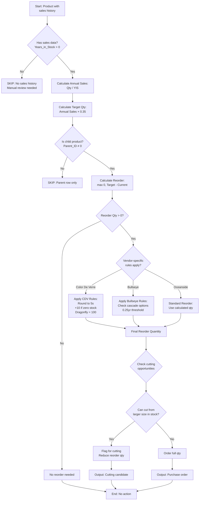
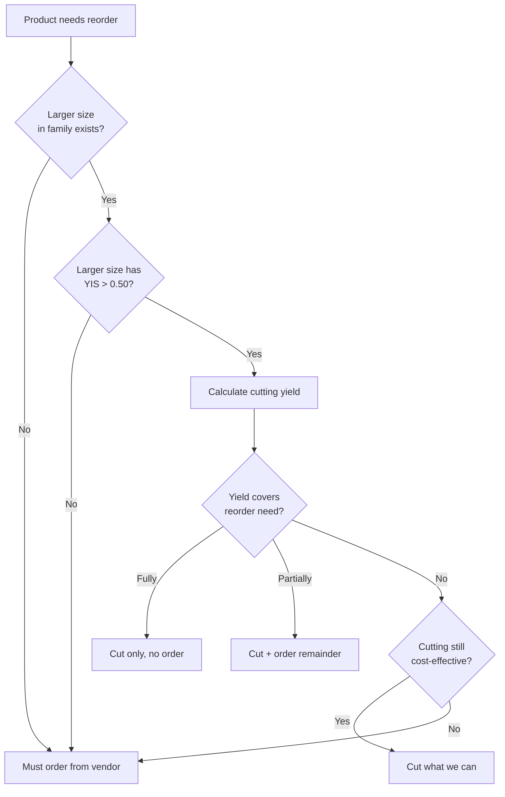

# Reorder Calculation Workflow

**Purpose:** Calculate reorder quantities to reach target Years in Stock
**System:** Oceanside Glass (adaptable to other systems)
**Format:** Decision tree (per CLAUDE.md Rule A)

---

## Overview

This workflow calculates optimal reorder quantities based on:
1. Current stock levels
2. Historical sales (annual purchased)
3. Target coverage (0.35 years = 4.2 months)
4. Years in Stock metric

---

## Reorder Calculation Decision Tree



---

## Detailed Calculation Steps

### Step 1: Validate Sales History

**Check:** Does product have `Years_in_Stock` value?

```python
if pd.isna(row['Years_in_Stock']) or row['Years_in_Stock'] <= 0:
    # Skip - no sales history
    continue
```

**Rationale:** Cannot calculate reorder without demand data

---

### Step 2: Calculate Annual Sales

**Formula:**
```python
annual_sales = row['Quantity_in_Stock'] / row['Years_in_Stock']

# Or from purchased directly:
annual_sales = row['Purchased'] / 365 * 365  # (if daily rate given)
```

**Example:**
- Current stock: 37 units
- Years in Stock: 0.16
- Annual sales: 37 / 0.16 = 231 units/year

---

### Step 3: Calculate Target Quantity

**Target:** 0.35 years coverage (128 days, 4.2 months)

**Formula:**
```python
target_quantity = annual_sales * 0.35
```

**Example:**
- Annual sales: 231 units
- Target qty: 231 × 0.35 = 80.85 → 81 units

---

### Step 4: Filter Child Products Only

**Check:** Is this a child product (actual size variant)?

```python
if row['Products_Parent_Id'] == 0 or pd.isna(row['Products_Parent_Id']):
    # Skip - this is parent row
    continue
```

**Rationale:** Only size variants need reordering, not parent entries

---

### Step 5: Calculate Reorder Quantity

**Formula:**
```python
reorder_quantity = max(0, target_quantity - current_stock)
```

**Example:**
- Target: 81 units
- Current: 37 units
- Reorder: 81 - 37 = 44 units

---

### Step 6: Apply Vendor-Specific Rules

#### Color De Verre Rules

```python
def apply_cdv_rules(reorder_qty, current_stock, product_id):
    # Rule 4: Dragonfly override
    if is_dragonfly_mold(product_id):
        return 100

    # Rule 3: Zero stock premium
    if current_stock == 0:
        reorder_qty += 10

    # Rule 2: Round to nearest 5
    reorder_qty = math.ceil(reorder_qty / 5) * 5

    return reorder_qty
```

**See:** [Color_De_Verre_Rules.md](../02_Business_Rules/Color_De_Verre_Rules.md)

---

#### Bullseye Rules

**Check cascade opportunities FIRST:**
```python
# Can we cut from existing inventory?
if can_cascade_from_larger_sizes(product):
    # Reduce or eliminate reorder
    reorder_qty = adjust_for_cascade(reorder_qty, cascade_available)

# Check 0.25yr threshold (not 0.35)
if years_in_stock < 0.25:
    flag_urgent = True
```

**See:** Bullseye Glass system documentation

---

#### Oceanside (Default)

Use calculated reorder quantity as-is

---

### Step 7: Check Cutting Opportunities

**Before placing order, check if larger sizes can be cut:**

```python
# Find family (all size variants)
family = get_family(product['Products_Parent_Id'])

for larger_size in family.larger_sizes:
    if larger_size.years_in_stock > 0.50:  # Oversupplied
        # Can cut from this size instead of ordering
        cutting_yield = calculate_yield(larger_size, product.size)
        potential_savings = min(reorder_qty, cutting_yield)

        flag_cutting_opportunity(product, larger_size, potential_savings)
```

**Output:** Flagged products with cutting alternatives

---

## Output Columns

### Added to CSV

| Column | Description | Example |
|--------|-------------|---------|
| Reorder_Quantity | Final reorder qty | 44 |
| Annual_Sales | Calculated sales rate | 231 |
| Target_Quantity | Target for 0.35 YIS | 81 |
| Initial_Reorder | Before vendor rules | 44 |
| Cutting_Available | Can cut from larger? | Yes/No |
| Cutting_Source | Which size to cut from | 24"×24" |

---

## Summary Statistics

### Report Generation

```
REORDER CALCULATION SUMMARY
===========================

Total products analyzed: 784
Products with sales history: 784
Products needing reorder: 124
Total reorder quantity: 278.01 units

Top 15 Products Requiring Reorder:
Product_ID | Size      | Current | YIS  | Reorder
------------------------------------------------------
165105     | 12"×12"   | 37      | 0.16 | 43.94
169634     | 12"×12"   | 1       | 0.03 | 10.67
158871     | 12"×12"   | 9       | 0.18 | 8.50
...

Cutting Opportunities: 65 families
- Larger sizes oversupplied (YIS > 0.40)
- Smaller sizes undersupplied (Reorder > 0)
- Cutting could reduce purchase costs
```

---

## Decision Matrix: Order vs Cut



---

## Examples

### Example 1: Standard Reorder (No Cutting)
```
Product: 165105 (Thin Icicle Clear 12"×12")
Current stock: 37 units
Years in Stock: 0.16
Annual sales: 37 / 0.16 = 231 units
Target (0.35yr): 231 × 0.35 = 81 units
Reorder: 81 - 37 = 44 units

Family check:
- 24"×24": YIS = 0.22 (undersupplied, can't cut from)
- 6"×12": YIS = 0.18 (undersupplied)
- 6"×6": YIS = 0.15 (undersupplied)

Decision: ORDER 44 units (no cutting source available)
```

---

### Example 2: Cutting Opportunity
```
Product: 156686 (6"×6" variant)
Current stock: 1 unit
Years in Stock: 0.06
Annual sales: 1 / 0.06 = 17 units
Target (0.35yr): 17 × 0.35 = 6 units
Reorder: 6 - 1 = 5 units

Family check:
- 12"×12": YIS = 0.65 (OVERSUPPLIED - 237 days)
- 1× 12"×12" → 4× 6"×6" (yield = 4)

Decision: CUT 2× 12"×12" to get 8× 6"×6"
          No order needed (cutting covers need + buffer)
```

---

### Example 3: Color De Verre with Zero Stock
```
Product: CDV-12345 (Casting mold)
Current stock: 0 units
Years in Stock: 0.08
Annual sales: calculated as 12 units
Target (0.35yr): 12 × 0.35 = 4.2 units
Initial reorder: 4.2 - 0 = 4.2 → 5 units

CDV Rules Applied:
1. Zero stock: +10 → 15 units
2. Round to 5: already 15
3. Final: 15 units

Decision: ORDER 15 units (CDV multiples of 5 rule)
```

---

**Related Files:**
- [../02_Business_Rules/Years_In_Stock_Thresholds.md](../02_Business_Rules/Years_In_Stock_Thresholds.md)
- [../02_Business_Rules/Color_De_Verre_Rules.md](../02_Business_Rules/Color_De_Verre_Rules.md)
- [../02_Business_Rules/Glass_Sizes_and_Cutting_Yields.md](../02_Business_Rules/Glass_Sizes_and_Cutting_Yields.md)
- [Cut_Sheet_Generation_Workflow.md](./Cut_Sheet_Generation_Workflow.md)
