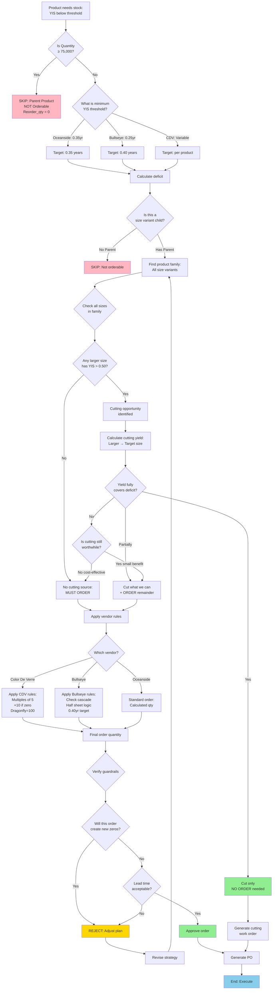
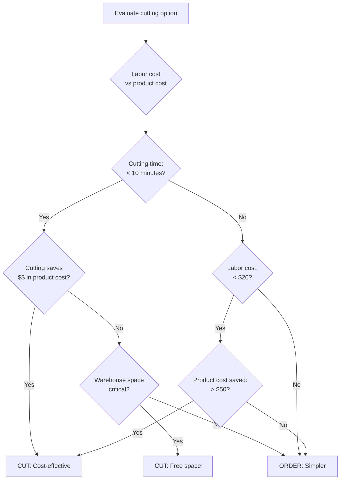
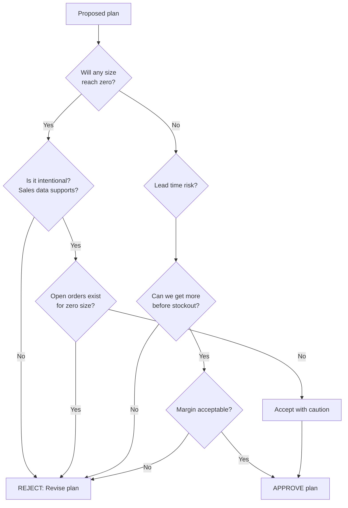

# Vendor Order Decision Tree

**Purpose:** Decide whether to order from vendor or cut from existing inventory
**Applies to:** All glass systems (Oceanside, Bullseye, Color De Verre)
**Format:** Decision tree (per CLAUDE.md Rule A)

---

## Overview

Before placing any vendor order, this decision tree evaluates:
1. Can we cut from existing inventory instead?
2. What's the most cost-effective option?
3. Which sizes need vendor orders vs internal cutting?

---

## Master Order Decision Flowchart



---

## Decision Criteria by System

### Oceanside Glass

| Question | Threshold | Action |
|----------|-----------|--------|
| Needs stock? | YIS < 0.35 | Calculate deficit |
| Cutting source? | Other size YIS > 0.50 | Consider cutting |
| Safety minimum | YIS >= 0.20 | Don't zero out sources |
| Optimal range | 0.35 - 0.40 | Target zone |

---

### Bullseye Glass (Cut Sheets)

| Question | Threshold | Action |
|----------|-----------|--------|
| Needs stock? | YIS < 0.25 OR Stock = 0 | Flag for cutting |
| Tier 1 priority? | Stock = 0 | HIGHEST priority |
| Cycle frequency | 14 days | Biweekly evaluation |
| Good enough | YIS >= 0.25 | Sufficient coverage |

**Special Rules:**
- Getting off zero > perfect margins
- Cascade cutting to minimize trips
- Don't sacrifice popular sizes (10×10 protection)

---

### Bullseye Glass (Ordering)

| Question | Threshold | Action |
|----------|-----------|--------|
| Order trigger? | ANY size YIS < 0.25 | Start order calc |
| Order target | ALL sizes YIS >= 0.40 | Order goal |
| Lead time buffer | +35 days | Safety margin |
| 3mm special rule | 2 Half = 1 Full equiv | Check before ordering |

**Cascade Sequence:**
1. Check existing inventory cascade FIRST
2. Calculate minimum order
3. Cascade from new order
4. Verify all sizes >= 0.40yr

---

### Color De Verre

| Question | Threshold | Action |
|----------|-----------|--------|
| Base quantity | Always | Multiples of 5 |
| Zero stock? | Stock = 0 | Add 10 units |
| Dragonfly mold? | Specific SKU | Always 100 |
| Rounding | All orders | Ceiling to next 5 |

---

## Cutting vs Ordering Cost Analysis

### When Cutting Makes Sense



---

### Cutting Advantages
- **No lead time:** Immediate stock
- **No shipping cost:** Already on-site
- **Inventory optimization:** Balance YIS across sizes
- **Free warehouse space:** Reduce oversupplied sizes

### Ordering Advantages
- **No labor cost:** Direct to shelf
- **Preserve variety:** Keep full sheets available
- **Bulk pricing:** May get volume discounts
- **Less complexity:** Simpler workflow

---

## Guardrails (Safety Checks)

### Before Approving ANY Order/Cut



### Critical Guardrails

1. **Don't create new zeros** (unless data-driven)
   - Check sales: 24"×24" only 5.9% of sales → OK to zero
   - But if open orders exist → KEEP STOCK

2. **Lead time coverage**
   - Bullseye: 35-72 days typical
   - Oceanside: TBD
   - CDV: TBD
   - Keep minimum stock through next order cycle

3. **Margin protection**
   - Don't cut if it hurts profit margin
   - Some products sold at full-sheet premium

4. **Special products**
   - Rare colors/textures: protect full sheets
   - Seasonal (Holly Berry Red): order by deadline
   - High-demand: maintain safety buffer

---

## Multi-Size Family Example

### Scenario: Oceanside Product Family 156660

```
Current State:
- 6"×6" (156661):   Stock=0,  YIS=0.00  ← ZERO STOCK
- 6"×12" (156662):  Stock=0,  YIS=0.00  ← ZERO STOCK
- 12"×12" (156663): Stock=3,  YIS=0.45  ← Oversupplied
- 24"×24" (156664): Stock=1,  YIS=0.30  ← Undersupplied

Decision Path:
1. Identify zeros: 6"×6" and 6"×12" URGENT
2. Check cutting sources:
   - 12"×12" has YIS=0.45 (>0.40) ✓ Can cut
   - 1× 12"×12" → 4× 6"×6"
   - 1× 12"×12" → 2× 6"×12"
3. Impact of cutting:
   - 6"×6": 0 → 4 (RESOLVED)
   - 6"×12": 0 → 2 (RESOLVED)
   - 12"×12": 3 → 1 (still >0) ✓
   - 24"×24": 1 → 1 (unchanged)
4. Verify guardrails:
   - No new zeros created ✓
   - All sizes have stock ✓
   - Labor: ~5 min ($5 cost)
   - Product saved: ~$30
5. Decision: CUT 2× 12"×12", NO VENDOR ORDER
```

---

## Vendor Order Template

### When Order IS Required

**Order Details:**
```
Vendor: [Bullseye / Oceanside / CDV]
Product Family: [Parent_ID] [Description]
Order Date: [YYYY-MM-DD]
Expected Delivery: [+lead time]

Items to Order:
Size          | Current | Target | YIS Now | YIS After | Order Qty
----------------------------------------------------------------
24"×24"       | 1       | 8      | 0.30    | 0.42      | 7 sheets
```

**Justification:**
- No cutting source available (all sizes undersupplied)
- Current YIS below threshold (0.30 < 0.35)
- Lead time: [days] - need order now to prevent stockout

---

## Output Reports

### Cutting Work Order
**For products resolved by cutting:**
```
WORK ORDER: CUT-2025-001
Product Family: 156660 (Oceanside Almond Opalescent)
Priority: HIGH (Tier 1 - zeros exist)

Cuts Required:
1. Cut 1× 12"×12" (156663) → 4× 6"×6" (156661)
2. Cut 1× 12"×12" (156663) → 2× 6"×12" (156662)

Expected Results:
- 6"×6": 0 → 4 units (YIS: 0.00 → 0.30)
- 6"×12": 0 → 2 units (YIS: 0.00 → 0.25)
- 12"×12": 3 → 1 units (YIS: 0.45 → 0.15)

Labor: ~5 minutes
Cost Savings: ~$30 vs ordering
```

---

### Purchase Order
**For products requiring vendor order:**
```
PURCHASE ORDER: PO-2025-042
Vendor: Bullseye Glass
Order Date: 2025-01-15
Expected Delivery: 2025-02-20 (+35 days)

Line Items:
1. SKU 0100-030: Full Sheet 3mm Clear - Qty: 3
   Justification: No cutting source, all sizes low YIS
2. SKU 0225-030: Full Sheet 3mm Blue - Qty: 2
   Justification: Half sheet deficit, save as halves

Order Value: $XXX
Shipping: $XX
Total: $XXX
```

---

**Related Files:**
- [../02_Business_Rules/Years_In_Stock_Thresholds.md](../02_Business_Rules/Years_In_Stock_Thresholds.md)
- [../02_Business_Rules/Glass_Sizes_and_Cutting_Yields.md](../02_Business_Rules/Glass_Sizes_and_Cutting_Yields.md)
- [../02_Business_Rules/Color_De_Verre_Rules.md](../02_Business_Rules/Color_De_Verre_Rules.md)
- [Reorder_Calculation_Workflow.md](./Reorder_Calculation_Workflow.md)
- [Cut_Sheet_Generation_Workflow.md](./Cut_Sheet_Generation_Workflow.md)
