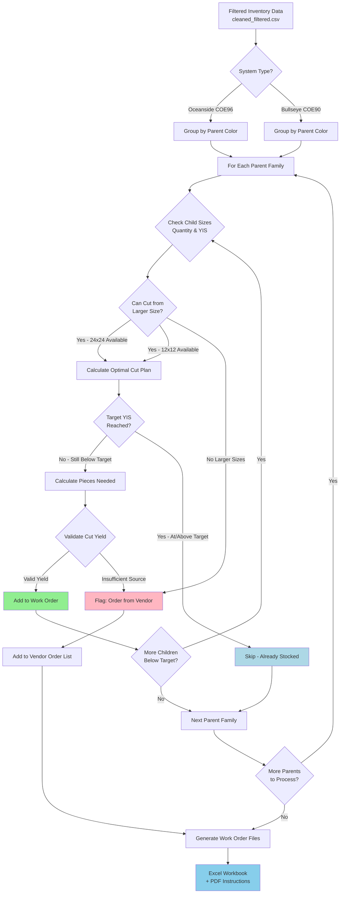

# Work Order Generation Process

**Purpose:** Convert filtered inventory data into actionable cutting instructions
**Applies to:** Oceanside Glass (COE96), Bullseye Glass (COE90)
**Last Updated:** 2025-12-21

---

## 📋 Overview

This workflow transforms cleaned inventory data (after filtering) into work orders that tell the cutting team exactly what to cut, from what size, and how many pieces to make.

---

## 🎯 Work Order Generation Decision Tree



---

## 📊 Process Steps

### 1. **Load Filtered Data**
**Input:** `cleaned_filtered.csv` from Inventory Filtering Workflow
**Action:** Group products by Parent ID (color families)

### 2. **Determine System Type**
- **Oceanside COE96**: Target YIS = 0.35 years (4.2 months)
  - Sizes: 24"×24", 12"×12", 6"×12", 6"×6"
- **Bullseye COE90**: Target YIS varies by system
  - Cut Sheets: 0.25 years minimum
  - Ordering: 0.40 years target
  - Sizes: Full (17"×20"), Half, 10×10, 5×10, 5×5

### 3. **For Each Parent Family**

#### Step 3a: Check Child Inventory Status
For each child size, check:
- **Quantity on hand**
- **Years in Stock (YIS)**
- **Sales velocity** (units sold in last 12 months)

#### Step 3b: Identify Cutting Opportunities
Check if larger sizes have inventory:
- **Oceanside**: 24"×24" can cut to 12"×12", 6"×12", 6"×6"
- **Oceanside**: 12"×12" can cut to 6"×12", 6"×6"
- **Oceanside**: 6"×12" can cut to 6"×6"
- **Bullseye**: Full can cascade down to smaller sizes

#### Step 3c: Calculate Pieces Needed
**Formula:**
```
Target Quantity = (Units Sold ÷ 12 months) × Target YIS × 12
Pieces Needed = Target Quantity - Current Quantity
```

**Example (Oceanside 6"×6" size):**
- Units sold: 326/year
- Target YIS: 0.35 years
- Current quantity: 50
```
Target Quantity = (326 ÷ 12) × 0.35 × 12 = 113.7 ≈ 114 pieces
Pieces Needed = 114 - 50 = 64 pieces
```

#### Step 3d: Determine Cut Source
**Decision Logic:**
1. **If 24"×24" available:** Cut from full sheets (best yield)
2. **If 12"×12" available:** Cut from half sheets
3. **If 6"×12" available:** Cut 6"×6" only
4. **If no larger sizes:** Add to vendor order list

#### Step 3e: Validate Cut Yield
Check if source size has enough quantity:

**Oceanside Cutting Yields:**
| Source Size | Target Size | Pieces per Cut | Kerf Loss |
|-------------|-------------|----------------|-----------|
| 24"×24" | 12"×12" | 4 | ~5% |
| 24"×24" | 6"×12" | 8 | ~7% |
| 24"×24" | 6"×6" | 16 | ~10% |
| 12"×12" | 6"×12" | 2 | ~5% |
| 12"×12" | 6"×6" | 4 | ~7% |
| 6"×12" | 6"×6" | 2 | ~3% |

**Formula to check:**
```
Sheets Needed = CEIL(Pieces Needed ÷ Pieces per Cut)
Available? = (Source Quantity >= Sheets Needed)
```

**Example:**
- Need 64 pieces of 6"×6"
- Cut from 24"×24" (16 pieces per sheet)
- Sheets needed = CEIL(64 ÷ 16) = 4 sheets
- If we have ≥4 sheets of 24"×24", proceed to cut

### 4. **Generate Work Order Output**

#### Excel Workbook Structure
**Columns:**
1. **Parent_ID** - Color identification
2. **Parent_Name** - Full product name
3. **Source_Size** - What to cut from (e.g., "24×24")
4. **Target_Size** - What to cut to (e.g., "6×6")
5. **Sheets_to_Cut** - How many source sheets
6. **Pieces_to_Produce** - Expected output pieces
7. **Current_YIS** - Before cutting
8. **Target_YIS** - Goal (0.35 for Oceanside)
9. **Notes** - Special instructions

**Sort Order:**
1. By Parent Name (alphabetical)
2. By Source Size (largest to smallest)
3. By Target Size (largest to smallest)

#### PDF Instructions Format
**One page per parent color showing:**
- Color name and ID
- Current inventory status (table of all 4 sizes)
- Cutting instructions (what to cut from what)
- Expected final inventory after cuts
- Quality notes (if applicable)

---

## 🔍 Example Work Order Entry

**Parent:** Oceanside Glass Almond Opalescent 3mm COE96

**Current Inventory:**
| Size | Qty | YIS | Status |
|------|-----|-----|--------|
| 24"×24" | 8 | 0.52 | Overstocked |
| 12"×12" | 116 | 0.36 | At target |
| 6"×12" | 50 | 0.19 | Below target |
| 6"×6" | 50 | 0.15 | Below target |

**Work Order Instructions:**
1. **Cut 2 sheets of 24"×24" → 16 pieces of 6"×12"**
   - Current 6"×12": 50 pieces (0.19 YIS)
   - After cut: 66 pieces (0.25 YIS)
   - Remaining 24"×24": 6 sheets (0.39 YIS)

2. **Cut 4 sheets of 24"×24" → 64 pieces of 6"×6"**
   - Current 6"×6": 50 pieces (0.15 YIS)
   - After cut: 114 pieces (0.35 YIS) ✓ Target reached
   - Remaining 24"×24": 2 sheets (0.13 YIS)

**Result:** Optimizes inventory using overstocked 24"×24" to bring smaller sizes to target.

---

## ⚠️ Critical Checks Before Finalizing

### 1. Cascade Opportunities (Bullseye Only)
**ALWAYS check if Half Sheet cascade is possible:**
- For 3mm glass: 2 Half Sheets = 1 Full Sheet equivalent
- Must verify Half Sheet ends with ≥0.40 YIS after cascade
- See: [Cascade Cutting Logic Reference](../../06_Reference_Data/Cascade_Cutting_Logic.md)

### 2. Don't Zero Out Critical Sizes
**Oceanside Rule:** Can zero out 24"×24" (only 5.9% of sales)
**Bullseye Rule:** Never zero out Full sheets (needed for cascade)

### 3. Validate Final YIS
After all cuts, ensure:
- No size drops below minimum YIS (0.20 years = 73 days)
- Target sizes reach goal YIS
- Source sizes don't become understocked

### 4. Special Cases
**Flag for manual review if:**
- Parent has unusual size configuration (not standard 4 children)
- Cutting would zero out all larger sizes
- Target requires cutting entire inventory of source size
- Size names don't parse correctly (see Size Detection workflow)

---

## 🔗 Related Workflows

- **Prerequisite:** [Inventory Filtering Workflow](./Inventory_Filtering_Workflow.md)
- **Business Rules:** [Years in Stock Thresholds](../02_Business_Rules/Years_In_Stock_Thresholds.md)
- **Business Rules:** [Glass Sizes and Cutting Yields](../02_Business_Rules/Glass_Sizes_and_Cutting_Yields.md)
- **Alternative:** [Vendor Order Decision Tree](./Vendor_Order_Decision_Tree.md) (when cutting not viable)
- **Output Format:** [Output Generation Templates](../04_Output_Generation/Work_Order_Format.md)

---

## 📈 Success Metrics

**Good work order:**
- ✅ Brings below-target sizes to goal YIS
- ✅ Uses overstocked sizes as source
- ✅ Doesn't zero out critical inventory
- ✅ Clear, actionable instructions
- ✅ Sorted logically for cutting efficiency

**Red flags:**
- ❌ Cutting would zero out Full sheets (Bullseye)
- ❌ Insufficient source quantity for required cuts
- ❌ Final YIS still below minimum threshold
- ❌ More than 20% kerf loss expected

---

**Governance:** CLAUDE.md "Decision Tree First" Rule ✓
**Format:** Mermaid flowchart + markdown tables
**Cross-referenced:** 5 related documents
