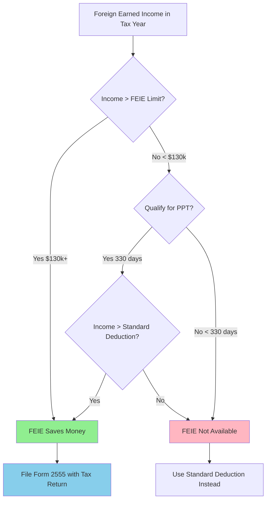

# FEIE Tax Tracking System

**Purpose:** Track Foreign Earned Income Exclusion (FEIE) eligibility using TaxBird location data
**Status:** Active tracking for 2025 tax year
**External Reference:** `C:\Users\tnguyen24_mantu\OneDrive\Claude Tools\FEIE\` (for tracking data and detailed ChatGPT export)

---

## 📋 What This Document Contains

This README provides comprehensive business rules, workflows, and decision logic for FEIE tax tracking. Use this as your primary reference - external folder contains tracking spreadsheets and archived research.

---

## System Overview

This system tracks FEIE eligibility using the **Physical Presence Test (PPT)**:
- **Required:** 330 full days in foreign countries within any rolling 12-month period
- **Tracking:** TaxBird app location logs (not calendar year - rolling 365 days!)
- **Goal:** Track qualifying days and U.S. days remaining

---

## 🎯 Decision Workflow: When Does FEIE Save Money?



**Key Insight:** FEIE only saves tax if your foreign earned income exceeds the standard deduction (~$14,600 for single filers in 2025). Below that threshold, standard deduction already eliminates tax.

---

## 📊 FEIE vs Standard Deduction

| Income Level | Standard Deduction | FEIE Benefit | Best Strategy |
|--------------|-------------------|--------------|---------------|
| $10,000 | Covers all income | $0 additional benefit | Standard deduction |
| $50,000 | Covers $14,600 | Excludes remaining $35,400 | **FEIE (saves ~$5,000)** |
| $100,000 | Covers $14,600 | Excludes remaining $85,400 | **FEIE (saves ~$15,000)** |
| $130,000 | Covers $14,600 | Excludes all remaining $115,400 | **FEIE (saves ~$20,000)** |
| $150,000+ | Covers $14,600 | Excludes max $130,000 | **FEIE + pay tax on excess** |

**Note:** Tax savings estimates assume ~18% effective federal tax rate. Actual savings vary by tax bracket.

---

## 📁 External Files Reference

### Documentation
**`2025-12-16_05-35-04_ChatGPT_How_FEIE_eligibility_actually_works_(the_short_version).md`**
- Detailed 319KB ChatGPT export with comprehensive FEIE explanation
- Located in: `C:\Users\tnguyen24_mantu\OneDrive\Claude Tools\FEIE\`

### Tracking Data
**`FEIE_Tracker_2025.xlsx`**
- TaxBird export integration
- Daily location classification
- Rolling window calculations
- U.S. days remaining counter
- Located in: `C:\Users\tnguyen24_mantu\OneDrive\Claude Tools\FEIE\`

---

## 📅 Critical Concept: Rolling 12-Month Window

**Most Important FEIE Rule:** The test is NOT based on calendar year!

### How the Rolling Window Works

```
Example Timeline:
2025 Jan |---U.S.---|
2025 Feb |---U.S.---|
2025 Mar |--U.S.-|Foreign starts Mar 11|
2025 Apr |---------Foreign----------|
2025 May |---------Foreign----------|
2025 Jun |---------Foreign----------|
...
2026 Mar |---------Foreign----------|
2026 Apr |---------Foreign----------|
2026 May |--Foreign--|U.S. visit|
```

**Test:** Slide a 12-month window across the timeline. Find the FIRST window where:
- Foreign days ≥ 330
- Window can start/end on any date

**Example Result:**
- First qualifying window: **May 18, 2025 → May 17, 2026** (330 foreign days)
- Retroactive FEIE start: **Aug 2, 2025** (when window overlaps with 2025 tax year)
- For 2025 return: Exclude income from Aug 2 - Dec 31, 2025

### Why This Matters

**Common Misconception:** "I need 330 days in 2025 to qualify for 2025 tax year"

**Reality:** You can qualify for PART of 2025 even if you:
- Were in U.S. for Jan-Feb 2025
- Left in March 2025
- First qualifying window starts in May 2025

The key is finding ANY 12-month period with 330 foreign days, then claiming the portion that overlaps with the tax year.

---

## FEIE Rules Quick Reference

### Physical Presence Test
- **330 full days** in foreign countries
- **Any 12-month rolling period** (not calendar year!)
- **"Full day" = midnight-to-midnight** in foreign country
- **International waters/airspace** does not count
- **Maximum U.S. days:** 35 within any 12-month window (365 - 330 = 35)

### Key Dates (Example from Documentation)
- **First day left USA in 2025:** March 11, 2025
- **Permanent residency:** Mexico (February 2025)
- **Current location:** Vietnam (as of report date)

---

## Exclusion Amount

| Tax Year | Exclusion Limit | Notes |
|----------|----------------|-------|
| 2024 | $126,500 | Per qualifying person |
| 2025 | $130,000 | Per qualifying person |

---

## Important Gotchas

1. **FEIE doesn't reduce self-employment tax**
2. **U.S. government wages don't qualify**
3. **Choosing FEIE affects foreign tax credit options**
4. **No "reset" when visiting U.S.** - test is simply whether ANY 12-month span contains ≥330 foreign days

---

## Workflow

### Using TaxBird Data

1. **Export** TaxBird location data
2. **Classify** each date:
   - Qualifying foreign day (entire day in foreign country)
   - Non-foreign day (U.S., partial foreign, or international waters)
3. **Slide 12-month window** across timeline
4. **Find earliest window** that reaches 330 full foreign days
5. **Compute U.S. days remaining** in current active window
6. **Report:**
   - First qualifying window dates
   - Retroactive FEIE start date for tax return
   - U.S. days left in current best window

---

## Sample Report Format

```
First qualifying window: May 18, 2025 → May 17, 2026

Retroactive FEIE start date for 2025 return: Aug 2, 2025
(portion of 2025 tax year within qualifying period)

U.S. days left in current best window: 12
(includes any sea/air transit days outside foreign territory)
```

---

## Edge Cases to Watch

- **Leap year:** 366-day windows possible
- **Multi-country days:** Arrival/departure days
- **Late-night flight crossings:** Timestamp matters
- **International waters:** Doesn't count toward foreign days

---

## Related Systems

This is **NOT** a glass cutting system - it's personal tax tracking for international tax optimization.

**No crossover with:**
- Oceanside Glass
- Bullseye Glass
- Wildcats SEO
- Passport generation

---

**Last Updated:** 2025-12-16 (per documentation filename)
**Tax Year:** 2025
