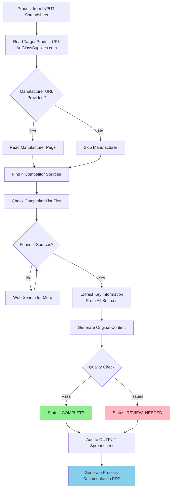

# Wildcats SEO Product Content System

**Purpose:** AI-generated SEO-optimized product content for ArtGlassSupplies.com
**Website:** https://www.artglasssupplies.com
**Status:** Active content generation system
**External Reference:** `C:\Users\tnguyen24_mantu\OneDrive\Claude Tools\Wildcats\` (for sample files and full specification)

---

## 📋 What This Document Contains

This README provides comprehensive workflows, style guides, and quality requirements for generating SEO product content. Use this as your primary reference - external folder contains sample INPUT/OUTPUT files and detailed specification (AI-SEO-Product-Content-System.md).

---

## System Overview

This AI-powered system generates SEO-optimized content for artglasssupplies.com products:

### What Gets Generated (Per Product)
1. Full Description (plain text + HTML)
2. Short Description (1-2 sentences)
3. Meta Title (50-60 characters)
4. Meta Description (140-160 characters)
5. Image Alt Text
6. Schema Markup (JSON-LD)
7. Process Documentation (PDF)

---

## 🎯 Content Generation Workflow



---

## 🔍 Competitor Research Process

### Priority Order
1. **Check Competitor List First** (prefer these):
   - delphiglass.com
   - edhoy.com
   - aaeglass.com
   - meltglass.com
   - stainedglassexpress.com

2. **Web Search** if fewer than 4 matches found

3. **Continue** until 4 competitor sources documented

### Fuzzy Matching Criteria
- Product name similarity
- Brand/manufacturer match
- Product type/category match
- Key specifications match

**Note:** Not every competitor carries every product - that's expected!

---

## 📁 External Files Reference

### Primary Documentation
**`AI-SEO-Product-Content-System.md`**
- Complete 319-line specification
- Full project overview and requirements
- Located in: `C:\Users\tnguyen24_mantu\OneDrive\Claude Tools\Wildcats\`

### Sample Files (in Wildcats folder)
- **`INPUT_Sample.csv`** - Example input format
- **`OUTPUT_Sample.csv`** - Example generated content
- **`OUTPUT_Sample_Documentation.html`** - Process documentation sample

---

## Workflow

### Input Requirements (Per Product)
- **Target_Product_URL** (required) - ArtGlassSupplies.com product page
- **Manufacturer_Supplier_URL** (when available)
- **Competitor_URLs** (optional)
- **Notes** (optional special instructions)

### Competitor Research Process
1. Check provided competitor site list first:
   - delphiglass.com
   - edhoy.com
   - aaeglass.com
   - meltglass.com
   - stainedglassexpress.com
2. Web search for additional sources if needed
3. Continue until **4 competitor sources** documented

### AI Generation Process
1. Read ArtGlassSupplies.com product page
2. Read manufacturer/supplier page (if provided)
3. Find similar products on competitor sites (fuzzy matching)
4. Generate original, SEO-optimized content

---

## Style Guide Summary

### Tone
**Write like:** Knowledgeable glass artist helping a fellow hobbyist
**Avoid:** Superlatives, hype, marketing fluff

### Description Structure (HTML)
```html
<p><strong>One-sentence summary with primary benefit.</strong></p>
<ul>
  <li>Key feature or specification</li>
  <li>Material or quality detail</li>
  <li>Primary use case</li>
</ul>
<p>Expanded paragraph explaining applications.</p>
```

### Formatting Rules
- First sentence is bold
- Use bullet points for features
- **No emojis**
- No excessive capitalization

---

## SEO Requirements

### Meta Title
- **Length:** 50-60 characters
- **Format:** `Product Name | Art Glass Supplies`
- **Example:** `ZYP Boron Nitride Mold Release Spray 13oz | Art Glass Supplies`

### Meta Description
- **Length:** 140-160 characters
- **Focus:** Natural language, benefit-driven, encourages click-through
- **Example:** `Reliable mold release for glass fusing and casting. Works with ceramic and steel molds. Easy spray application, lasts several firings. Shop ZYP at Art Glass Supplies.`

### Image Alt Text
- Clear description
- Include product name
- No keyword stuffing
- **Example:** `ZYP Boron Nitride Mold Primer 13 oz aerosol spray can`

---

## Output Package

### 1. OUTPUT Spreadsheet (CSV)
**Columns:**
- Product_ID
- Full_Description_Plain
- Full_Description_HTML
- Short_Description_Plain
- Meta_Title
- Meta_Description
- Image_Alt_Text
- Schema_Markup_JSON
- Product (documentation page number)
- Status (COMPLETE/PARTIAL/REVIEW_NEEDED)

### 2. Process Documentation (PDF)
**One page per product showing:**
- Sources reviewed (AGS, manufacturer, competitors)
- Key information extracted from each source
- Content decisions and reasoning
- Product number reference

---

## Quality Checklist

Before approving each product:
- [ ] Product name spelled correctly
- [ ] Specifications match manufacturer data
- [ ] No competitor brand names in content
- [ ] Meta title under 60 characters
- [ ] Meta description under 160 characters
- [ ] Tone is helpful, not salesy
- [ ] No placeholder text
- [ ] Content focuses on glass art applications
- [ ] PDF documentation makes sense

---

## ✅ Good vs Bad Examples

### ❌ Bad (Vague, Salesy, Generic)
> "This amazing mold release spray is the best product for all your glass art needs! You'll love how incredible it works. A must-have for any serious artist! Get yours today and experience the difference!"

**Problems:**
- Superlatives ("amazing," "best," "incredible")
- No specific information
- Marketing fluff
- No practical details
- Doesn't mention compatibility or specs

### ✅ Good (Specific, Helpful, Informative)
> "ZYP Boron Nitride Mold Primer provides reliable release for ceramic and stainless steel molds used in glass fusing, slumping, and casting. Industrial-strength formula rated to 1800°F. Apply three light coats with 15 minutes dry time between each. One application lasts several firings."

**Why This Works:**
- Specific product name and purpose
- Clear compatibility (ceramic, stainless steel)
- Concrete specs (1800°F rating)
- Usage instructions (3 coats, 15 min dry time)
- Practical benefit (lasts several firings)

---

## 📝 Complete Example: ZYP Boron Nitride Mold Primer

**Product ID:** 162068

### Meta Title (58 characters)
```
ZYP Boron Nitride Mold Release Spray 13oz | Art Glass Supplies
```

### Meta Description (157 characters)
```
Reliable mold release for glass fusing and casting. Works with ceramic and steel molds. Easy spray application, lasts several firings. Shop ZYP at Art Glass Supplies.
```

### Short Description
```
Industrial-strength mold release spray for ceramic and stainless steel molds. Prevents sticking, produces clean releases, and lasts several firings. 13 oz aerosol can.
```

### Full Description (HTML)
```html
<p><strong>ZYP Boron Nitride Mold Primer provides reliable release for ceramic and stainless steel molds used in glass fusing, slumping, and casting.</strong></p>
<ul>
  <li>Industrial-strength formula rated to 1800°F</li>
  <li>Works with detailed casting molds like Colour de Verre</li>
  <li>Water-based formula washes off easily after firing</li>
  <li>One application lasts several firings</li>
</ul>
<p>This spray applies quickly and dries in minutes, creating a smooth barrier that prevents glass from sticking. Apply three light coats with 15 minutes dry time between each. Produces clean releases without spurs or sharp edges on your finished pieces.</p>
```

### Image Alt Text
```
ZYP Boron Nitride Mold Primer 13 oz aerosol spray can
```

### Schema Markup (JSON-LD)
```json
{
  "@context": "https://schema.org/",
  "@type": "Product",
  "name": "ZYP Boron Nitride Mold Primer 13 oz",
  "description": "Industrial-strength mold release spray for ceramic and stainless steel molds used in glass fusing, slumping, and casting.",
  "sku": "162068",
  "brand": {
    "@type": "Brand",
    "name": "ZYP Coatings"
  },
  "material": "Boron Nitride",
  "offers": {
    "@type": "Offer",
    "url": "https://www.artglasssupplies.com/zyp-boron-nitride-mold-primer-13-oz",
    "priceCurrency": "USD",
    "price": "48.89",
    "availability": "https://schema.org/InStock"
  }
}
```

---

## Review Workflow

1. AGS team completes INPUT spreadsheet
2. AI generates OUTPUT package (spreadsheet + PDF)
3. Human reviews each row:
   - Check PDF page for AI's reasoning
   - Verify accuracy (specs match source)
   - Confirm no competitor names in content
   - Confirm appropriate tone
4. Approved rows uploaded to database

---

## Related Systems

**Not related to glass cutting systems (Oceanside/Bullseye)** - this is marketing content generation for e-commerce.

---

**Last Updated:** 2025-12-21
**Website:** https://www.artglasssupplies.com
