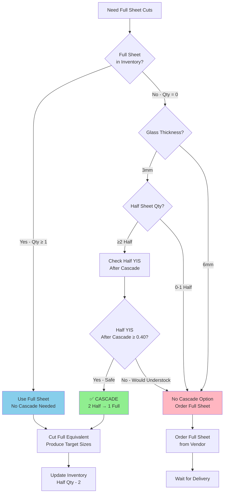

# Cascade Cutting Logic Reference

**System:** Bullseye Glass COE90 only
**Glass Type:** 3mm thickness ONLY (does NOT apply to 6mm)
**Last Updated:** 2025-12-21

---

## 🎯 What is Cascade Cutting?

**Cascade** is the process of combining 2 Half Sheets to create the equivalent of 1 Full Sheet for cutting purposes.

**Key Rule:** For 3mm Bullseye glass, **2 Half Sheets = 1 Full Sheet** (cutting capacity)

**Critical:** This is THE MOST COMMON ERROR in Bullseye cutting workflows. Always check cascade opportunities BEFORE ordering Full sheets.

---

## 📋 Why Cascade Matters

### Without Cascade Check

**Scenario:**
- Need: 4 pieces of 10×10
- Full Sheet inventory: 0
- Half Sheet inventory: 18 pieces (0.65 YIS)

**Wrong Decision:** Order 1 Full Sheet from vendor ($$$)

### With Cascade Check

**Scenario (same):**
- Need: 4 pieces of 10×10
- Full Sheet inventory: 0
- Half Sheet inventory: 18 pieces (0.65 YIS)

**Correct Decision:**
1. Cascade: Use 2 Half Sheets → Creates 1 Full Sheet equivalent
2. Cut the Full equivalent → Produces 4× 10×10
3. Remaining Half Sheets: 18 - 2 = 16 (0.58 YIS ✓ still > 0.40 minimum)

**Result:** Save money, use existing inventory, avoid vendor order

---

## 🔢 Cascade Mathematics

### Basic Equivalence

```
2 Half Sheets (3mm) = 1 Full Sheet (cutting capacity)
```

**This means:**
- 2 Half can be cut into the same pieces as 1 Full
- Yield from cascade: 4× 10×10 + 2× 5×10 + scrap

### Cascade Validation Formula

Before cascading, verify:

```
Half Sheets After Cascade = Current Half Qty - 2
Half YIS After Cascade = (Half After Cascade) ÷ (Half Units Sold ÷ 12)

Required: Half YIS After Cascade ≥ 0.40 years
```

**Example:**
- Current Half Sheets: 18 pieces
- Units sold: 24.6/year (2.05/month)
```
Half After Cascade = 18 - 2 = 16 pieces
Half YIS After = 16 ÷ (24.6 ÷ 12) = 16 ÷ 2.05 = 7.8 months ≈ 0.65 years
```
✅ **Result:** 0.65 years > 0.40 minimum → Safe to cascade

---

## ⚠️ Critical Constraints

### Constraint 1: 3mm Only

**Applies to:** 3mm Bullseye glass
**Does NOT apply to:** 6mm Bullseye glass

**Why:** Different thickness = different cutting behavior and yields

### Constraint 2: Half Sheet Minimum YIS = 0.40

**All other Bullseye sizes:** 0.25 years minimum
**Half Sheets:** 0.40 years minimum (higher threshold!)

**Why:** Half sheets have strategic value, must maintain higher inventory

**Formula Check:**
```
IF (Half YIS After Cascade) < 0.40 THEN
    DO NOT cascade
    Order Full Sheet instead
END IF
```

### Constraint 3: Must Have 2+ Half Sheets

**Minimum for cascade:** 2 Half Sheets
**Best practice:** ≥4 Half Sheets (allows cascade while maintaining buffer)

**Decision Table:**

| Half Sheets | Can Cascade? | Recommendation |
|-------------|--------------|----------------|
| 0-1 | ❌ No | Order Full Sheet |
| 2-3 | ⚠️ Possible | Check YIS carefully |
| 4-10 | ✅ Yes | Likely safe to cascade |
| 11+ | ✅ Yes | Definitely safe |

---

## 🎯 Cascade Decision Tree



---

## 📊 Cascade Examples

### Example 1: Safe Cascade (Common Scenario)

**Situation:**
- **Need:** 4 pieces of 10×10 (to reach 0.40 YIS)
- **Full Sheet:** 0 in stock
- **Half Sheet:** 18 pieces (0.65 YIS)
- **Glass:** 3mm Bullseye Black Opal

**Check Cascade:**
```
Current Half: 18 pieces
After Cascade: 18 - 2 = 16 pieces
Units Sold: 24.6/year
Half YIS After: 16 ÷ (24.6 ÷ 12) = 0.65 years
```
✅ **0.65 > 0.40** → Safe to cascade

**Decision:** Cascade 2 Half → 1 Full, cut to 4× 10×10

**Result:**
- 10×10: +4 pieces (target reached)
- Half: 18 → 16 pieces (still well-stocked)
- Full: Saved vendor order ($$$)

---

### Example 2: Unsafe Cascade (Would Understock)

**Situation:**
- **Need:** 4 pieces of 10×10
- **Full Sheet:** 0 in stock
- **Half Sheet:** 4 pieces (0.38 YIS)
- **Glass:** 3mm Bullseye Teal Green

**Check Cascade:**
```
Current Half: 4 pieces
After Cascade: 4 - 2 = 2 pieces
Units Sold: 30/year
Half YIS After: 2 ÷ (30 ÷ 12) = 2 ÷ 2.5 = 0.80 years
```
Wait... 0.80 > 0.40, so safe?

**BUT WAIT - Check current YIS:**
Current Half YIS = 0.38 years (ALREADY below 0.40 minimum!)

❌ **Cannot cascade - already understocked**

**Decision:** Order Full Sheet from vendor, DO NOT cascade

**Reason:** Half is already below minimum threshold, would make problem worse

---

### Example 3: Barely Safe Cascade

**Situation:**
- **Need:** 4 pieces of 10×10
- **Full Sheet:** 0 in stock
- **Half Sheet:** 8 pieces (0.65 YIS)
- **Glass:** 3mm Bullseye Clear

**Check Cascade:**
```
Current Half: 8 pieces
After Cascade: 8 - 2 = 6 pieces
Units Sold: 18/year (1.5/month)
Half YIS After: 6 ÷ 1.5 = 4.0 months = 0.33 years
```
❌ **0.33 < 0.40** → Would drop below minimum

**Decision:** Order Full Sheet, DO NOT cascade

**Explanation:** Even though we have 8 Half sheets, cascading would drop YIS below the 0.40 threshold for Half sheets.

---

### Example 4: Multiple Cascades Possible

**Situation:**
- **Need:** 16 pieces of 10×10 (large order)
- **Full Sheet:** 0 in stock
- **Half Sheet:** 30 pieces (1.2 YIS, well-stocked)
- **Glass:** 3mm Bullseye White Opal

**Calculation:**
- Need 4× 10×10 per Full
- Total needed: 16 ÷ 4 = 4 Full sheets equivalent
- Can cascade: 4 Full = 8 Half sheets needed

**Check Cascade:**
```
Current Half: 30 pieces
After Cascade: 30 - 8 = 22 pieces
Half YIS After: 22 ÷ (24 ÷ 12) = 22 ÷ 2 = 11 months ≈ 0.92 years
```
✅ **0.92 > 0.40** → Safe to cascade multiple times

**Decision:** Cascade 8 Half → 4 Full equivalent, cut all

**Result:**
- 10×10: +16 pieces
- Half: 30 → 22 pieces (still well-stocked at 0.92 YIS)
- Saved ordering 4 Full sheets!

---

## 🔧 Implementation Checklist

### Before Any Bullseye 3mm Work Order

- [ ] **1. Check glass thickness**
  - 3mm? Proceed to cascade check
  - 6mm? Skip cascade logic

- [ ] **2. Identify Full Sheet needs**
  - Which target sizes need Full sheet cuts?
  - How many Full sheets required?

- [ ] **3. Check Full Sheet inventory**
  - Full in stock? Use it, skip cascade
  - Full out of stock? Proceed to cascade check

- [ ] **4. Validate Half Sheet cascade opportunity**
  - [ ] Half Sheet quantity ≥ 2?
  - [ ] Current Half YIS ≥ 0.40?
  - [ ] After-cascade Half YIS ≥ 0.40?

- [ ] **5. Make decision**
  - All cascade checks pass? ✅ Cascade
  - Any check fails? ❌ Order Full from vendor

- [ ] **6. Document decision**
  - Note in work order why cascaded or why ordered
  - Show Half YIS before/after

---

## 🚨 Common Errors

### Error 1: Forgot to Check Cascade (MOST COMMON!)

**What happens:**
- Order Full Sheet when Half sheets available
- Waste money on vendor order
- Miss inventory optimization opportunity

**Prevention:**
- **ALWAYS** check cascade FIRST for 3mm Bullseye
- Add "Cascade Check" to every Bullseye workflow
- See CLAUDE.md Critical Reminders

### Error 2: Applied Cascade to 6mm Glass

**What happens:**
- Incorrect cutting plan
- Wrong yield calculations
- Confusion on work floor

**Prevention:**
- Check thickness BEFORE checking cascade
- 3mm = cascade possible
- 6mm = cascade NOT possible

### Error 3: Cascaded Below 0.40 YIS

**What happens:**
- Half Sheet inventory drops below safety threshold
- Next order cycle has insufficient Half inventory
- Cascade opportunity lost for future work orders

**Prevention:**
- Verify Half YIS AFTER cascade ≥ 0.40
- Use formula: (Current Half - 2) ÷ (Units Sold ÷ 12) ≥ 0.40

### Error 4: Assumed 1 Half = 0.5 Full

**What happens:**
- Wrong math: 1 Half ≠ 0.5 Full for cascade
- Must use 2 Half at a time
- Cannot cascade single Half sheet

**Prevention:**
- Remember: 2 Half = 1 Full (minimum 2 required)
- Cannot cascade odd numbers (1, 3, 5 Half sheets)

---

## 🔗 Related Documents

- **Decision Workflows:**
  - [Cut Sheet Logic Decision Tree](../03_Decision_Workflows/Cut_Sheet_Logic_Decision_Tree.md) - Uses cascade logic
  - [Work Order Generation Process](../03_Decision_Workflows/Work_Order_Generation_Process.md) - Implements cascade
- **Business Rules:**
  - [Years in Stock Thresholds](../02_Business_Rules/Years_In_Stock_Thresholds.md) - Half = 0.40 minimum
  - [Glass Sizes and Cutting Yields](../02_Business_Rules/Glass_Sizes_and_Cutting_Yields.md) - Bullseye yields
- **System Guide:**
  - [Bullseye Glass System README](../05_System_Specific/Bullseye_Glass_System/README.md)
- **External Reference:**
  - `Bullseye Glass/MASTER_CONTEXT_PROMPT.md` - Full system documentation

---

## 💡 Quick Reference Card

```
┌─ CASCADE QUICK CHECK (3mm Bullseye Only) ──┐
│                                             │
│ ✅ Can Cascade IF ALL TRUE:                │
│    • Glass is 3mm (not 6mm)                │
│    • Full Sheet inventory = 0              │
│    • Half Sheet quantity ≥ 2               │
│    • Current Half YIS ≥ 0.40               │
│    • After-cascade Half YIS ≥ 0.40         │
│                                             │
│ Formula:                                    │
│   Half After = Current Half - 2            │
│   YIS After = Half After ÷ (Sold ÷ 12)    │
│   Required: YIS After ≥ 0.40               │
│                                             │
│ ❌ Order Full Sheet IF ANY FALSE           │
│                                             │
└─────────────────────────────────────────────┘
```

---

**Governance:** CLAUDE.md Critical Reminders ✓
**Format:** Decision tree + formulas + worked examples
**Cross-referenced:** 6 related documents
