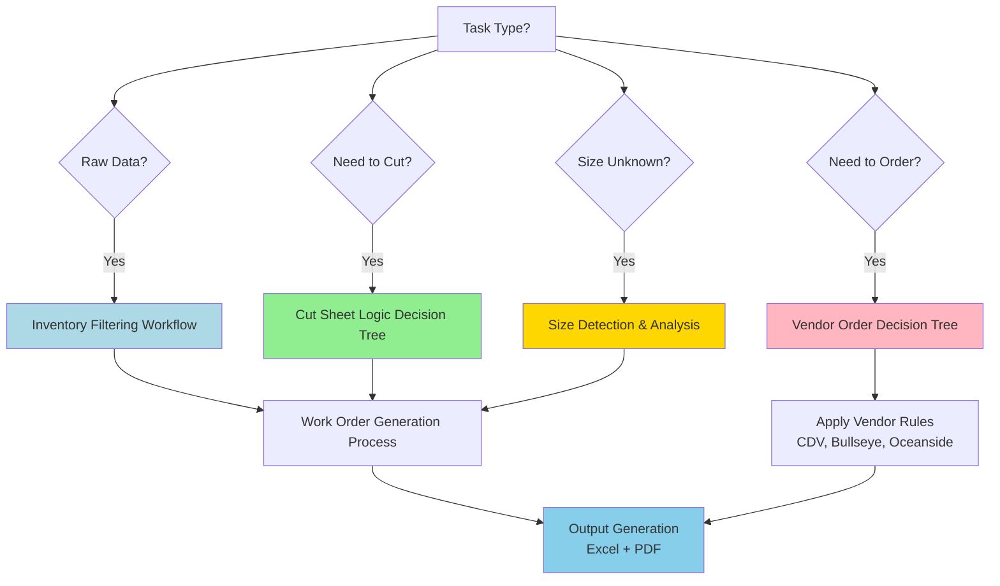

# Decision Framework Examples

**Purpose:** Real-world scenarios showing how to apply decision trees and business rules
**Format:** Problem → Analysis → Decision → Outcome
**Last Updated:** 2025-12-21

---

## 📋 Overview

This document provides complete worked examples showing:
1. How to identify which workflow/decision tree applies
2. How to gather necessary data
3. How to apply business rules step-by-step
4. How to validate the decision
5. What the expected outcome looks like

---

## 🎯 Example 1: Standard Oceanside Work Order

### Scenario

**Product:** Oceanside Glass Forest Green 3mm COE96
**Current Inventory:**
- 24×24: 10 sheets, sold 60/year → YIS = 10÷60 = 0.17 (below minimum 0.20)
- 12×12: 120 pieces, sold 400/year → YIS = 120÷400 = 0.30 (below target 0.35)
- 6×12: 80 pieces, sold 250/year → YIS = 80÷250 = 0.32 (below target 0.35)
- 6×6: 60 pieces, sold 350/year → YIS = 60÷350 = 0.17 (well below target 0.35)

**Question:** What cutting strategy should be used?

---

### Analysis

**Step 1: Identify System**
- System: Oceanside COE96
- Target YIS: 0.35 years
- Can zero out 24×24: Yes (5.9% of sales)

**Step 2: Identify Below-Target Sizes**
- 24×24: 0.17 < 0.20 (below minimum, but can zero out)
- 12×12: 0.30 < 0.35 (below target)
- 6×12: 0.32 < 0.35 (below target)
- 6×6: 0.17 < 0.35 (well below target)

**Step 3: Check Cutting Opportunities**

**For 12×12:**
- Source: 24×24 (10 sheets available)
- Yield: 4 pieces per sheet
- Need: (400 × 0.35) - 120 = 140 - 120 = 20 pieces
- Sheets: CEIL(20 ÷ 4) = 5 sheets

**For 6×12:**
- Source: 24×24 (10 sheets) or 12×12 (120 pieces)
- Prefer 24×24 (largest source)
- Yield: 8 pieces per sheet
- Need: (250 × 0.35) - 80 = 87.5 - 80 = 7.5 → 8 pieces
- Sheets: CEIL(8 ÷ 8) = 1 sheet

**For 6×6:**
- Source: 24×24 (10 sheets), 12×12 (120 pieces), or 6×12 (80 pieces)
- Prefer 24×24 (largest source)
- Yield: 16 pieces per sheet
- Need: (350 × 0.35) - 60 = 122.5 - 60 = 62.5 → 63 pieces
- Sheets: CEIL(63 ÷ 16) = 4 sheets

**Step 4: Validate Source Inventory**

Total 24×24 needed: 5 + 1 + 4 = 10 sheets
Available: 10 sheets
After cuts: 10 - 10 = 0 sheets

Check if zero-out is acceptable:
- 24×24 is only 5.9% of sales → ✅ Can zero out (Oceanside exception)

---

### Decision

**Cutting Plan:**
1. Cut 5 sheets 24×24 → 20 pieces 12×12
2. Cut 1 sheet 24×24 → 8 pieces 6×12
3. Cut 4 sheets 24×24 → 64 pieces 6×6

**Expected Results:**
- 24×24: 10 → 0 sheets (0.00 YIS) ✓ Acceptable
- 12×12: 120 → 140 pieces (0.35 YIS) ✓ Target reached
- 6×12: 80 → 88 pieces (0.35 YIS) ✓ Target reached
- 6×6: 60 → 124 pieces (0.35 YIS) ✓ Target reached

---

### Outcome

✅ **Success:** All smaller sizes reach target YIS using overstocked/below-minimum 24×24 sheets
✅ **Efficient:** Used all available 24×24 inventory
✅ **Compliant:** Followed Oceanside exception rule

**Work Order:** Generate Excel + PDF with 3 cutting instructions

---

## 🎯 Example 2: Bullseye Cascade Opportunity

### Scenario

**Product:** Bullseye Glass Black Opal 3mm COE90
**Current Inventory:**
- Full Sheet (17×20): 0 sheets
- Half Sheet: 18 pieces, sold 24.6/year → YIS = 18÷24.6 = 0.73 (well above 0.40)
- 10×10: 30 pieces, sold 150/year → YIS = 30÷150 = 0.20 (at minimum)
- 5×10: 40 pieces, sold 80/year → YIS = 40÷80 = 0.50 (above target)
- 5×5: 50 pieces, sold 100/year → YIS = 50÷100 = 0.50 (above target)

**Question:** 10×10 is at minimum (0.20). Should we order Full sheets or use existing inventory?

---

### Analysis

**Step 1: Identify System**
- System: Bullseye COE90
- Thickness: 3mm → Cascade possible
- Target YIS: 0.40 years (Bullseye ordering)

**Step 2: Calculate 10×10 Needs**
- Target: 150 × 0.40 = 60 pieces
- Current: 30 pieces
- Need: 60 - 30 = 30 pieces
- Full sheets needed: CEIL(30 ÷ 4) = CEIL(7.5) = 8 Full sheets

Wait, that's wrong!
Yield from 1 Full = 4× 10×10 (not considering 5×10 and scrap)
Actually need: CEIL(30 ÷ 4) = 8 Full sheets

**Step 3: Check Full Sheet Availability**
- Full sheets: 0 in stock
- **CRITICAL: Check cascade before ordering!**

**Step 4: Cascade Check (3mm Bullseye)**

Can we cascade Half → Full?
```
Thickness: 3mm ✓
Half Qty: 18 ≥ 2 ✓
Current Half YIS: 0.73 ≥ 0.40 ✓

Check after cascade:
Need 8 Full = 16 Half sheets
Half after: 18 - 16 = 2 pieces
Half YIS after: 2 ÷ (24.6 ÷ 12) = 2 ÷ 2.05 = 0.98 months = 0.08 years
```
❌ **0.08 < 0.40** → Would drop below minimum!

**Re-evaluate:** Can we cascade fewer?

Try cascading for partial need:
```
Cascade 2 Half → 1 Full → 4× 10×10
Half after: 18 - 2 = 16 pieces
Half YIS after: 16 ÷ 2.05 = 7.8 months = 0.65 years ✓ > 0.40
```

Result: Get 4 pieces 10×10, still need 26 more

---

### Decision

**Hybrid Strategy:**
1. **Cascade:** 2 Half → 1 Full, cut to 4× 10×10
2. **Order:** 26 pieces of 10×10 from vendor (or 7 Full sheets if ordering sheets)

**Expected Results:**
- Half: 18 → 16 pieces (0.73 → 0.65 YIS) ✓ Still well above 0.40
- 10×10: 30 + 4 = 34 pieces (0.23 YIS) → then +26 from vendor = 60 pieces (0.40 YIS) ✓

---

### Outcome

✅ **Smart:** Used cascade for partial fulfillment (saved 1 Full sheet order)
✅ **Safe:** Half Sheet maintained above 0.40 minimum
✅ **Efficient:** Hybrid approach (cascade + order)

❌ **Alternative (Wrong):** Would have been to order all 8 Full sheets, ignoring cascade opportunity

---

## 🎯 Example 3: Color De Verre Vendor Order

### Scenario

**Product:** Color De Verre Powder (Purple)
**Current Inventory:**
- Quantity: 0 units
- Units sold: 22/year
- Target YIS: 0.35 years

**Question:** How many units to order from vendor?

---

### Analysis

**Step 1: Calculate Base Need**
```
Target Quantity = 22 × 0.35 = 7.7 → 8 units
Current: 0
Need: 8 - 0 = 8 units
```

**Step 2: Apply CDV Rule 1 (Multiples of 5)**
```
Base Order = CEIL(8 ÷ 5) × 5
Base Order = CEIL(1.6) × 5 = 2 × 5 = 10 units
```

**Step 3: Apply CDV Rule 2 (Zero Stock Adjustment)**
```
Current Qty = 0 → Add 10 units
Adjusted Order = 10 + 10 = 20 units
```

**Step 4: Check CDV Rule 3 (Dragonfly Exception)**
```
Product = "Purple Powder" ≠ "Dragonfly Mold"
No exception applies
```

---

### Decision

**Order Quantity:** 20 units

**Rationale:**
- Rule 1: 10 units (multiple of 5)
- Rule 2: +10 for zero stock
- Total: 20 units

---

### Outcome

✅ **Compliant:** Follows all 3 CDV rules
✅ **Buffer:** Extra units provide safety margin
✅ **Vendor Accept:** Order will be accepted (multiple of 5)

**Expected YIS after delivery:**
```
20 ÷ 22 = 0.91 years (well above target, good buffer)
```

---

## 🎯 Example 4: Size Detection Failure

### Scenario

**Product Name:** "Oceanside Glass Sample Pack Mixed Sizes COE96"
**Column C:** "Sample Pack Mixed Sizes"

**Question:** How to classify this product for work order?

---

### Analysis

**Step 1: Apply Regex Patterns**

Pattern 1: `\d+\s*[xX×]\s*\d+`
```
"Sample Pack Mixed Sizes" → No match
```

Pattern 2: `\d+"\s*x\s*\d+"`
```
"Sample Pack Mixed Sizes" → No match
```

Pattern 3: Full dimension with units
```
"Sample Pack Mixed Sizes" → No match
```

**Step 2: Fallback to Keyword Search**

Check for: "Full", "Full Sheet", "Half", "Half Sheet"
```
"Sample Pack Mixed Sizes" → No keywords found
```

**Step 3: Result**
```
Size = SIZE_UNKNOWN
Flag for manual review
```

---

### Decision

**Action:** Flag as SIZE_UNKNOWN → Manual Review Queue

**Reason:**
- No dimension pattern detected
- No fallback keywords found
- Product name indicates "Mixed Sizes" (ambiguous)
- Cannot determine cutting strategy

**Manual Review Required:**
- Human to verify what sizes are in the pack
- Possibly exclude from work order (not cuttable)
- May need to update product naming convention

---

### Outcome

⚠️ **Flagged:** Product excluded from automated work order
✅ **Safe:** Prevents incorrect cutting calculations
📋 **Queue:** Added to manual review list for human verification

**Process Improvement:**
- Suggest standardized naming: "Oceanside Sample 6x6 Pack" instead of "Mixed Sizes"

---

## 🎯 Example 5: Multi-Step Decision (Inventory Filtering + Cutting)

### Scenario

**Raw Data:** Oceanside inventory export with 1,410 rows

**Question:** How to generate work order from raw data?

---

### Analysis

**Step 1: Apply Inventory Filtering Workflow**

**1a. Keyword Removal**
```
Remove rows with: "reserve", "frit", "stringers", "noodles", "pound", "pack"
Result: 1,410 → 784 rows (626 removed)
```

**1b. Well-Stocked Families (4-child rule)**
```
Find families where:
- Exactly 4 children
- ALL 4 have YIS > 0.40

Example removed:
Parent: "Amber Transparent"
- 24×24: 0.45 YIS
- 12×12: 0.42 YIS
- 6×12: 0.48 YIS
- 6×6: 0.41 YIS
All > 0.40 → Remove entire family

Result: 784 → 740 rows (11 families, 44 rows removed)
```

**1c. Zero-Stock Families**
```
Find families where ALL children have Qty = 0
Result: 740 → 680 rows (15 families, 60 rows removed)
```

**1d. Smallest-Only Families**
```
Find families where:
- Only 6×6 has stock > 0
- All larger sizes (6×12, 12×12, 24×24) = 0

Cannot cut smaller from smaller → Remove

Result: 680 → 650 rows (7 families, 30 rows removed)
```

**Filtering Complete:**
```
Original: 1,410 rows
Final: 650 rows
Removed: 760 rows (54%)
```

**Step 2: Apply Work Order Generation Process**

For each remaining family (650 rows = ~162 families with 4 children each):

**Example Family: "Forest Green"**
```
24×24: 10 sheets, 0.17 YIS
12×12: 120 pieces, 0.30 YIS
6×12: 80 pieces, 0.32 YIS
6×6: 60 pieces, 0.17 YIS
```

Apply Cut Sheet Logic (from Example 1):
- Cut 5 sheets 24×24 → 20× 12×12
- Cut 1 sheet 24×24 → 8× 6×12
- Cut 4 sheets 24×24 → 64× 6×6

**Repeat for all 162 families**

---

### Decision

**Complete Workflow:**
1. ✅ Filter raw data (1,410 → 650 rows)
2. ✅ Group by families (~162 families)
3. ✅ Apply cutting logic to each family
4. ✅ Generate work order (Excel + PDF)

**Expected Output:**
- Work order with ~400-500 cutting instructions
- Sorted by Parent Name, Source Size, Target Size
- PDF with 1 summary page + ~162 family pages

---

### Outcome

✅ **Automated:** Complete pipeline from raw data to actionable work order
✅ **Efficient:** Filtered out 54% of non-actionable rows
✅ **Comprehensive:** All 162 families optimized

**Time Saved:** Manual process would take days, automated takes minutes

---

## 📚 Decision Tree Navigation Guide

### How to Choose the Right Workflow

**Start Here:** What is your task?



**Workflow Selection Table:**

| Task | Use This Workflow | Location |
|------|-------------------|----------|
| Clean raw inventory data | Inventory Filtering Workflow | `03_Decision_Workflows/` |
| Determine cutting strategy | Cut Sheet Logic Decision Tree | `03_Decision_Workflows/` |
| Generate cutting instructions | Work Order Generation Process | `03_Decision_Workflows/` |
| Decide order vs cut | Vendor Order Decision Tree | `03_Decision_Workflows/` |
| Parse product sizes | Size Detection & Analysis | `03_Decision_Workflows/` |
| Check Bullseye cascade | Cascade Cutting Logic | `06_Reference_Data/` |
| Look up formulas | Formulas Quick Reference | `06_Reference_Data/` |
| Troubleshoot issues | Common Errors | `06_Reference_Data/` |

---

## 🔗 Related Documents

- **Workflows:** All files in [03_Decision_Workflows/](../03_Decision_Workflows/)
- **Business Rules:** All files in [02_Business_Rules/](../02_Business_Rules/)
- **Reference:** All files in [06_Reference_Data/](../06_Reference_Data/)
- **System Guides:** All README files in [05_System_Specific/](../05_System_Specific/)

---

**Governance:** CLAUDE.md "Decision Framework examples" ✓
**Format:** Worked examples + decision navigation
**Cross-referenced:** All major workflows
